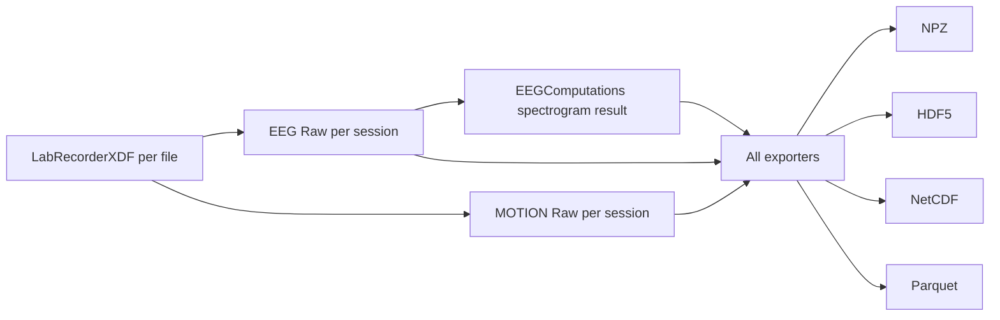

# Add EEG/MOTION Aligned Session Exports

## Scope

Add spectrogram-aligned export support (via mapping metadata, not forced resampling) in [c:\Users\pho\repos\ACTIVE_DEV\PhoOfflineEEGAnalysis\main_analyze_run.py](c:\Users\pho\repos\ACTIVE_DEV\PhoOfflineEEGAnalysis\main_analyze_run.py) for:

- Rerun NPZ export
- HDF5 export
- NetCDF export
- Parquet export

## Implementation Approach

- Keep existing spectrogram payload unchanged for backward compatibility.
- Add **raw EEG** and **raw MOTION** arrays per session.
- Add explicit **alignment metadata** linking each modality time axis to spectrogram time bins.

## Data Flow Changes

- In `process_XDFs_main(...)`, retain session-level MOTION raw objects (parallel to EEG/session results) so downstream exporters receive both modalities for each session.
- Pass modality raws into all export functions from the `__main_`_ export block.

## Export Schema Additions

For each session export record/group:

- `eeg_raw_data` and `eeg_raw_times_sec`
- `motion_raw_data` and `motion_raw_times_sec` (if available; otherwise empty/NaN + availability flag)
- `eeg_channel_names`, `motion_channel_names`
- Alignment metadata:
  - `spectrogram_times_sec`
  - `spectrogram_start_time_sec` and `spectrogram_end_time_sec`
  - `eeg_time_origin_meas_date_sec`, `motion_time_origin_meas_date_sec`
  - `alignment_method = "raw_plus_map"`
  - optional index maps (`eeg_nearest_spectrogram_bin_idx`, `motion_nearest_spectrogram_bin_idx`) when size is manageable

## File-Level Change Plan

- Update [c:\Users\pho\repos\ACTIVE_DEV\PhoOfflineEEGAnalysis\main_analyze_run.py](c:\Users\pho\repos\ACTIVE_DEV\PhoOfflineEEGAnalysis\main_analyze_run.py):
  - Extend `process_XDFs_main(...)` outputs to include per-session MOTION raws (ordered identically to EEG/results).
  - Extend signatures and internals of:
    - `export_spectrograms_for_rerun(...)`
    - `export_spectrograms_hdf5(...)`
    - `export_spectrograms_netcdf(...)`
    - `export_spectrograms_parquet(...)`
  - Add small helper(s) to extract modality arrays/times safely from `mne.Raw` and build shared alignment metadata.
  - Keep exports robust when MOTION is missing by writing explicit null/empty placeholders and a `has_motion` flag.

## Validation Plan

- Run one short-session export end-to-end and verify each output contains:
  - Original spectrogram fields
  - EEG raw fields + times
  - MOTION raw fields + times (or `has_motion=false`)
  - Alignment metadata fields
- Confirm no regressions in printed completion summary and file generation paths.

