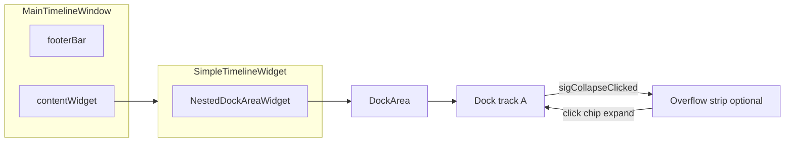

# Collapsed dock overflow region (MainTimelineWindow + pyqtgraph docks)

## How things work today

- [`MainTimelineWindow.ui`](c:\Users\pho\repos\EmotivEpoc\ACTIVE_DEV\pyPhoTimeline\pypho_timeline\widgets\TimelineWindow\MainTimelineWindow.ui) lays out `contentWidget` (timeline), optional `logPanel`, and [`footerBar`](c:\Users\pho\repos\EmotivEpoc\ACTIVE_DEV\pyPhoTimeline\pypho_timeline\widgets\TimelineWindow\MainTimelineWindow.ui) (session jump, spacer, log toggle, refresh). There is no native dock chrome at the window level.
- [`SimpleTimelineWidget`](c:\Users\pho\repos\EmotivEpoc\ACTIVE_DEV\pyPhoTimeline\pypho_timeline\widgets\simple_timeline_widget.py) hosts [`NestedDockAreaWidget`](c:\Users\pho\repos\EmotivEpoc\ACTIVE_DEV\pyPhoTimeline\pypho_timeline\docking\nested_dock_area_widget.py) as `timeline.ui.dynamic_docked_widget_container`; tracks are added via [`DynamicDockDisplayAreaContentMixin.add_display_dock`](c:\Users\pho\repos\EmotivEpoc\ACTIVE_DEV\pyPhoTimeline\pypho_timeline\docking\dynamic_dock_display_area.py).
- Collapse is implemented in [`Dock` (pyqtgraph fork)](c:\Users\pho\repos\EmotivEpoc\ACTIVE_DEV\pyPhoTimeline\pypho_timeline\EXTERNAL\pyqtgraph\dockarea\Dock.py): the title-bar button calls `toggleContentVisibility()`, sets `contentsHidden`, and emits **`sigCollapseClicked`** with the `Dock` instance. The dock **stays** in the `DockArea`; only content visibility changes.

## Recommended approach: footer "chip strip" synced to collapsed docks

**Idea:** Add a horizontal region (e.g. `QScrollArea` + inner `QWidget` with `QHBoxLayout`) in the footer (or a `QToolBar` under the menu bar if you prefer a top overflow). For each **leaf** dock you care about:

1. **On `sigCollapseClicked`:** After the toggle, read `dock.contentsHidden`. If `True`, show or highlight a `QToolButton` (or `QPushButton`) labeled with `dock.title()` / `dock.name()`. If `False`, remove or de-emphasize that chip.
2. **On chip click:** If the dock is collapsed, call `dock.toggleContentVisibility()` once to expand (or call the same path the collapse button uses — avoid double-toggling).
3. **On `sigClosed`:** Remove the chip (reuse the existing `dDisplayItem.sigClosed` connection pattern in `add_display_dock`).

**Registration timing:** Today, [`add_display_dock`](c:\Users\pho\repos\EmotivEpoc\ACTIVE_DEV\pyPhoTimeline\pypho_timeline\docking\dynamic_dock_display_area.py) connects `sigClosed` but does **not** emit `sigDockAdded` (that emission exists only on a different mixin path in [`specific_dock_widget_mixin.py`](c:\Users\pho\repos\EmotivEpoc\ACTIVE_DEV\pyPhoTimeline\pypho_timeline\docking\specific_dock_widget_mixin.py)). For robust behavior when tracks are added after startup, either:

- **Emit `sigDockAdded(self, dDisplayItem)` from `add_display_dock`** when the container implements that signal (`NestedDockAreaWidget` already declares it), and have the overflow controller connect there; **or**
- **Centralize registration inside `add_display_dock`** (e.g. call a small `CollapsedDockOverflowController.register_dock(dock)`).

**Filtering:** Skip docks with `hideTitleBar` / group meta-docks if you do not want them in the strip — [`get_leaf_only_flat_dock_identifiers_list`](c:\Users\pho\repos\EmotivEpoc\ACTIVE_DEV\pyPhoTimeline\pypho_timeline\docking\dynamic_dock_display_area.py) or the same metadata used elsewhere is a good filter.

## UI placement (header vs footer)

| Location | Pros |
|----------|------|
| **Footer** (extend [`footerBar`](c:\Users\pho\repos\EmotivEpoc\ACTIVE_DEV\pyPhoTimeline\pypho_timeline\widgets\TimelineWindow\MainTimelineWindow.ui)) | Matches existing session jump + log controls; natural "tray" metaphor. |
| **`QToolBar` (top)** via `MainTimelineWindow.addToolBar(Qt.TopToolBarArea)` | Separates overflow from footer actions; can stay visible if footer grows. |

Default recommendation: **footer**, inserting the scroll strip **before** the horizontal spacer so session controls stay left and overflow + existing right-aligned buttons stay grouped (adjust order to taste).

## Wiring to `MainTimelineWindow`

- Add the strip widget in **`.ui`** (or create it in [`MainTimelineWindow.initUI`](c:\Users\pho\repos\EmotivEpoc\ACTIVE_DEV\pyPhoTimeline\pypho_timeline\widgets\TimelineWindow\MainTimelineWindow.py)) and expose e.g. `attach_collapsed_dock_overflow(self, nested_dock_area: NestedDockAreaWidget)` that builds the controller.
- Call that from [`timeline_builder.build_from_datasources`](c:\Users\pho\repos\EmotivEpoc\ACTIVE_DEV\pyPhoTimeline\pypho_timeline\timeline_builder.py) **after** `_add_tracks_to_timeline` and `_embed_log_widget_in_timeline` (so log dock exists if you want it listed), passing `timeline.ui.dynamic_docked_widget_container`.

## Optional advanced behavior (later)

- **True overflow when many collapsed:** Cap visible chips and add a "…" menu listing the rest (`QMenu` from a tool button).
- **Hide dock title bar when "in tray only":** Requires changes to [`Dock.py`](c:\Users\pho\repos\EmotivEpoc\ACTIVE_DEV\pyPhoTimeline\pypho_timeline\EXTERNAL\pyqtgraph\dockarea\Dock.py) / layout — more invasive; the chip strip alone already gives a single place to find collapsed tracks without changing pyqtgraph geometry.

## What will *not* work without a larger rewrite

- Expecting **`QMainWindow` + `QDockWidget`** features (native minimize-to-area, tabbed dock overflow) to apply to pyqtgraph `DockArea` — they are separate systems.
