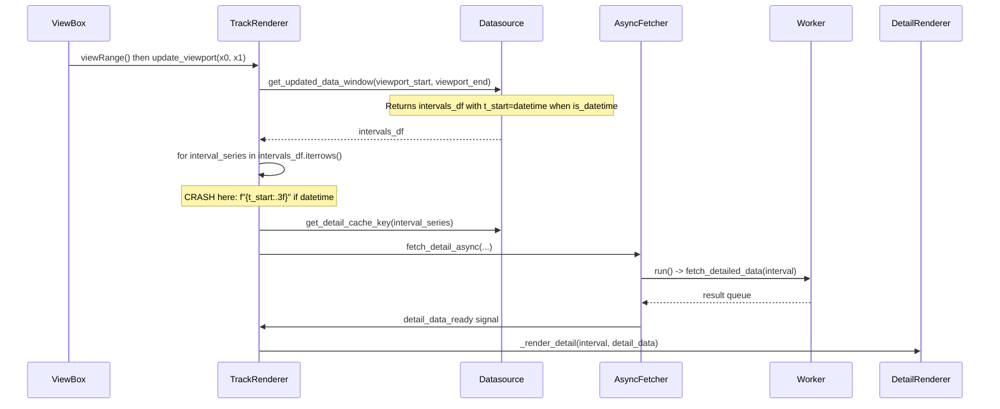

# Root cause: Why detail views never show (datetime/float)

## Data flow




## Cause 1: TrackRenderer crashes in the viewport loop (main blocker)

**File**: [pypho_timeline/rendering/graphics/track_renderer.py](c:\Users\pho\repos\EmotivEpoc\ACTIVE_DEV\pyPhoTimeline\pypho_timeline\rendering\graphics\track_renderer.py)

**Where**: `update_viewport` → `process_viewport_update()` → loop over `intervals_df.iterrows()`.

- **Lines 329**: `logger.debug(..., start={viewport_start:.3f}, end={viewport_end:.3f})` — If the plot axis ever supplies non-float (e.g. datetime), this raises.
- **Lines 373–374 and 382–383**:  
`t_start_str = f"{t_start:.3f}" if t_start is not None else "?"`  
`t_duration_str = f"{t_duration:.3f}" if t_duration is not None else "?"`

When intervals use **datetime** (e.g. after the float→datetime change), `get_updated_data_window` returns an `intervals_df` with `t_start` as `pd.Timestamp` / datetime64 and `t_duration` as float (seconds). Formatting a `Timestamp` with `.3f` raises **TypeError**. The exception happens on the first interval, so:

- The loop never completes.
- No `fetch_detail_async` is called (or only up to the first iteration before the log line that crashes).
- `visible_intervals` is not updated correctly and no detail is ever requested or rendered.

**Fix**: Use a safe formatter for log-only display of `t_start`/`t_duration` (e.g. reuse the same pattern as `_format_interval_for_log` from [async_detail_fetcher.py](c:\Users\pho\repos\EmotivEpoc\ACTIVE_DEV\pyPhoTimeline\pypho_timeline\rendering\async_detail_fetcher.py): handle `None`, datetime/`Timestamp`, timedelta, and numeric). Apply it for the viewport debug line (329) and for the two cache HIT/MISS debug blocks (373–374, 382–383) so no `.3f` is used on non-numeric types.

---

## Cause 2: BaseTrackDatasource.get_detail_cache_key assumes float

**File**: [pypho_timeline/rendering/datasources/track_datasource.py](c:\Users\pho\repos\EmotivEpoc\ACTIVE_DEV\pyPhoTimeline\pypho_timeline\rendering\datasources\track_datasource.py) (lines 305–306)

```python
t_start = interval.get('t_start', 0.0)
t_duration = interval.get('t_duration', 0.0)
return f"{self.custom_datasource_name}_{t_start:.6f}_{t_duration:.6f}"
```

If any datasource uses this default (does not override `get_detail_cache_key`) and intervals have datetime `t_start` or timedelta/non-float `t_duration`, this raises and **fetch_detail_async** fails when computing `cache_key`, so no request is queued.

**Fix**: Make the default implementation datetime/timedelta-aware (e.g. same logic as `IntervalProvidingTrackDatasource.get_detail_cache_key`: normalize `t_start` to a string via timestamp/isoformat and `t_duration` via total_seconds/float, then build the key). Then all datasources that do not override are safe.

---

## Cause 3: fetch_detailed_data downsampling when t_duration is not float

**File**: [pypho_timeline/rendering/datasources/track_datasource.py](c:\Users\pho\repos\EmotivEpoc\ACTIVE_DEV\pyPhoTimeline\pypho_timeline\rendering\datasources\track_datasource.py) (lines 561–564)

```python
t_duration: float = interval.get('t_duration', (t_end - t_start))
max_allowed_points: int = int(t_duration * self.max_points_per_second)
```

If `t_duration` is a `pd.Timedelta` or the default `(t_end - t_start)` is a timedelta, then `t_duration * self.max_points_per_second` is a timedelta and `int(...)` may be wrong or raise. That would make **fetch_detailed_data** raise in the worker; the error is sent to **on_detail_data_ready** and the detail is not rendered.

**Fix**: Normalize `t_duration` to a float (seconds) before the downsampling block: if it's a timedelta use `total_seconds()`, else `float(t_duration)`. Use that for `max_allowed_points` and `curr_df_points_per_sec`.

---

## Cause 4 (optional): Viewport range type

**File**: [track_renderer.py](c:\Users\pho\repos\EmotivEpoc\ACTIVE_DEV\pyPhoTimeline\pypho_timeline\rendering\graphics\track_renderer.py) line 329

If the timeline x-axis is ever configured to use datetime and `viewRange()` returns non-float values, the first debug log in `process_viewport_update` will raise. Making the viewport log safe (as in Cause 1) avoids that.

---

## Cause 5 (optional): IntervalPlotDetailRenderer.get_detail_bounds returns datetime

**File**: [pypho_timeline/rendering/detail_renderers/generic_plot_renderer.py](c:\Users\pho\repos\EmotivEpoc\ACTIVE_DEV\pyPhoTimeline\pypho_timeline\rendering\detail_renderers\generic_plot_renderer.py) (lines 198–209)

`get_detail_bounds` returns `(t_start, t_start + t_duration, ...)` without converting to float. If `interval` has datetime `t_start`, callers that use these bounds for pyqtgraph (e.g. setXRange) may expect float and break. The **GenericPlotDetailRenderer._default_bounds** (78–96) already converts datetime to Unix timestamp; **IntervalPlotDetailRenderer.get_detail_bounds** does not.

**Fix**: In `IntervalPlotDetailRenderer.get_detail_bounds`, if `t_start` (or `t_duration`) is datetime/timedelta, normalize to float (e.g. timestamp and total_seconds) before returning, so the returned tuple is always (float, float, float, float).

---

## Recommended order of fixes

1. **TrackRenderer** (Cause 1 + 4): Add or reuse a safe interval/time formatter and use it for all debug logs that format `viewport_start`/`viewport_end` or `t_start`/`t_duration`. This unblocks the viewport loop and allows detail requests to be issued and processed.
2. **BaseTrackDatasource.get_detail_cache_key** (Cause 2): Make the default implementation support datetime/timedelta so no datasource raises when intervals use absolute time.
3. **IntervalProvidingTrackDatasource.fetch_detailed_data** (Cause 3): Normalize `t_duration` to seconds (float) before downsampling math.
4. **IntervalPlotDetailRenderer.get_detail_bounds** (Cause 5): Ensure returned bounds are always floats (convert datetime/timedelta to timestamp/seconds).

After (1), detail views should start showing again when intervals use datetime; (2)–(5) harden the rest of the path and avoid latent failures.