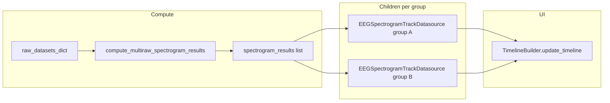

# Add spectrogram child tracks from channel groups

## Context (current behavior)

- [`SpectrogramChannelGroupConfig`](c:\Users\pho\repos\EmotivEpoc\ACTIVE_DEV\pyPhoTimeline\pypho_timeline\rendering\datasources\specific\eeg.py) and [`compute_multiraw_spectrogram_results`](c:\Users\pho\repos\EmotivEpoc\ACTIVE_DEV\pyPhoTimeline\pypho_timeline\rendering\datasources\specific\eeg.py) already exist. The helper runs `run_eeg_computations_graph(..., goals=("spectogram",))` per aligned raw and returns a **list length `len(intervals_df)`** with `None` padding when raw count and interval count differ—this is the same alignment contract used in [`stream_to_datasources.py`](c:\Users\pho\repos\EmotivEpoc\ACTIVE_DEV\pyPhoTimeline\pypho_timeline\rendering\datasources\stream_to_datasources.py) (lines 508–523).
- [`EEGSpectrogramTrackDatasource`](c:\Users\pho\repos\EmotivEpoc\ACTIVE_DEV\pyPhoTimeline\pypho_timeline\rendering\datasources\specific\eeg.py) stores `spectrogram_results` and optional `group_config`. The detail renderer averages only channels in `group_config` when set; when `group_config` is `None`, it averages **all** channels in the dict ([`EEGSpectrogramDetailRenderer._get_sxx_2d`](c:\Users\pho\repos\EmotivEpoc\ACTIVE_DEV\pyPhoTimeline\pypho_timeline\rendering\datasources\specific\eeg.py)). So **one full-channel spectrogram compute per session can back multiple tracks**—no need to re-run STFT per group unless you explicitly want `picks`-filtered STFT (see “Optional extension” below).
- UI insertion for new datasources is already standardized: [`TimelineBuilder.update_timeline`](c:\Users\pho\repos\EmotivEpoc\ACTIVE_DEV\pyPhoTimeline\pypho_timeline\timeline_builder.py) → `_add_tracks_to_timeline` → `timeline.add_track(...)`.

## API to add (on `EEGTrackDatasource`)

Add one public method in [`eeg.py`](c:\Users\pho\repos\EmotivEpoc\ACTIVE_DEV\pyPhoTimeline\pypho_timeline\rendering\datasources\specific\eeg.py) **after** `get_computed_results_for_sess` (or immediately before the `EEGSpectrogramDetailRenderer` section) so `EEGSpectrogramTrackDatasource` is defined when the method runs at runtime (no forward-declaration issues).

Suggested signature (exact names can be adjusted to your taste):

- `def add_spectrogram_tracks_for_channel_groups(self, spectrogram_channel_groups: Optional[List[SpectrogramChannelGroupConfig]], timeline: "SimpleTimelineWidget", timeline_builder: "TimelineBuilder", *, update_time_range: bool = False, skip_existing_names: bool = True) -> List["EEGSpectrogramTrackDatasource"]:`

Use `TYPE_CHECKING` imports for `SimpleTimelineWidget` and `TimelineBuilder` to avoid circular imports.

### Behavior

1. **Early exits**: If `spectrogram_channel_groups` is `None` or empty, mirror [`stream_to_datasources.py`](c:\Users\pho\repos\EmotivEpoc\ACTIVE_DEV\pyPhoTimeline\pypho_timeline\rendering\datasources\stream_to_datasources.py): treat as a **single** spectrogram track with `group_config=None`, `channel_group_presets=None` (or only pass presets when groups were non-empty—match stream logic).
2. **Raw handle parity**: If `raw_datasets_dict` has no raws, copy from `parent().raw_datasets_dict` when present (same pattern as [`EEGTrackDatasource.compute`](c:\Users\pho\repos\EmotivEpoc\ACTIVE_DEV\pyPhoTimeline\pypho_timeline\rendering\datasources\specific\eeg.py) / [`EEGSpectrogramTrackDatasource.compute`](c:\Users\pho\repos\EmotivEpoc\ACTIVE_DEV\pyPhoTimeline\pypho_timeline\rendering\datasources\specific\eeg.py)).
3. **Spectrogram results**: Call `compute_multiraw_spectrogram_results(self.intervals_df, self.raw_datasets_dict)` once. This keeps **interval alignment** identical to the stream builder and avoids relying on `computed_result["spectogram"]` from `EEGTrackDatasource.compute()`, whose list length follows the raw loop, not `intervals_df` (so it is **not** a safe drop-in for merged multi-interval timelines).
4. **Build children**: For each group (or the single “all channels” case), construct `EEGSpectrogramTrackDatasource(intervals_df=self.intervals_df.copy(), spectrogram_results=spec_results, custom_datasource_name=..., group_config=..., channel_group_presets=presets_when_multi, lab_obj_dict=self.lab_obj_dict, raw_datasets_dict=self.raw_datasets_dict, parent=self)`—same kwargs ordering/style as existing call sites in [`stream_to_datasources.py`](c:\Users\pho\repos\EmotivEpoc\ACTIVE_DEV\pyPhoTimeline\pypho_timeline\rendering\datasources\stream_to_datasources.py) (lines 511–520).
5. **Naming**: Use stable, collision-resistant names, e.g. `f"{self.custom_datasource_name}_Spectrogram_{group_cfg.name}"` for grouped mode and `f"{self.custom_datasource_name}_Spectrogram"` (or `_All`) for the single-track mode—aligned with how `EEG_Spectrogram_*` is detected for dock grouping in [`timeline_builder._add_tracks_to_timeline`](c:\Users\pho\repos\EmotivEpoc\ACTIVE_DEV\pyPhoTimeline\pypho_timeline\timeline_builder.py) (prefix `EEG_Spectrogram_` **or** `isinstance(..., EEGSpectrogramTrackDatasource)`). Prefer including the substring `EEG_Spectrogram_` in `custom_datasource_name` if you want guaranteed dock-group behavior when type checks fail.
6. **“As needed”**: If `skip_existing_names` and `name in timeline.track_datasources`, skip that child (log at info/debug).
7. **Finish**: If the list of new datasources is non-empty, call `timeline_builder.update_timeline(timeline, new_datasources, update_time_range=update_time_range)`.
8. **Return**: Return the list of **created** datasource instances (not skipped ones).

### Optional niceties (minimal scope)

- Append to a `List` field on the parent, e.g. `self._spectrogram_child_datasources`, only for created children (helps debugging / later removal).
- Optional Qt signal on `EEGTrackDatasource`, e.g. `sigSpectrogramTracksAdded = QtCore.Signal(object)`, emitted with the list after a successful `update_timeline`—only if you want loose coupling without passing callbacks.

## Tests / manual verification

- Extend or add a small test in [`tests/test_multi_raw_eeg_datasource.py`](c:\Users\pho\repos\EmotivEpoc\ACTIVE_DEV\pyPhoTimeline\tests\test_multi_raw_eeg_datasource.py): mock `timeline.track_datasources`, stub `TimelineBuilder.update_timeline`, assert correct number of `EEGSpectrogramTrackDatasource` instances with expected `group_config` and shared `spectrogram_results` identity—or skip tests if you only want manual notebook verification.

## Optional extension (not required for your stated goal)

If you later need **true per-group STFT** (smaller `picks` per run rather than average over full `Sxx`), add `global_params={"picks": group.channels}` to `run_eeg_computations_graph` (supported by [`EEGSpectrogramComputation`](c:\Users\pho\repos\EmotivEpoc\ACTIVE_DEV\PhoPyMNEHelper\src\phopymnehelper\analysis\computations\specific\EEG_Spectograms.py)) inside a new helper, e.g. `compute_multiraw_spectrogram_results_for_group(...)`, and pass distinct `spectrogram_results` per child. That is more CPU and more cache keys; the default plan above matches the existing timeline XDF path.
