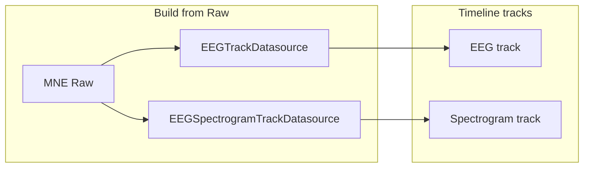

# Add EEG Spectrogram Computed Track Below EEG Track

## Context

- **EEG track** ([eeg.py](c:\Users\pho\repos\EmotivEpoc\ACTIVE_DEV\pyPhoTimeline\pypho_timeline\rendering\datasources\specific\eeg.py)): `EEGTrackDatasource` provides intervals and `detailed_df` (eeg_df); `EEGPlotDetailRenderer` draws channel line plots.
- **Spectrogram source** ([EEG_data.py](c:\Users\pho\repos\EmotivEpoc\ACTIVE_DEV\PhoPyMNEHelper\src\phopymnehelper\EEG_data.py)): `EEGComputations.raw_spectogram_working(raw, nperseg=1024, noverlap=512)` returns a dict: `t`, `freqs`, `fs`, `ch_names`, `spectogram_result_dict` (channel -> (f, t, Sxx)), `Sxx` (xarray: channels × freqs × times), `Sxx_avg`. Sxx shape is (n_freqs, n_times); display is typically `10*np.log10(Sxx+1e-12)` with time on x, frequency on y.
- **Timeline build paths**: (1) **From MNE Raw** ([timeline_builder.py](c:\Users\pho\repos\EmotivEpoc\ACTIVE_DEV\pyPhoTimeline\pypho_timeline\timeline_builder.py) `_extract_datasources_from_eeg_raw`): we have `raw` and can call `raw_spectogram_working(raw)`. (2) **From XDF streams** ([stream_to_datasources.py](c:\Users\pho\repos\EmotivEpoc\ACTIVE_DEV\pyPhoTimeline\pypho_timeline\rendering\datasources\stream_to_datasources.py)): only DataFrame (eeg_df), no Raw — spectrogram would require a separate DataFrame-based spectrogram helper.

## Architecture

- One new **track** (new row in the timeline), placed **immediately below** the EEG track.
- **Same intervals** as the EEG track (same overview bars).
- **Detail data**: spectrogram result dict; detail view renders it as a single 2D image (e.g. channel-averaged or first channel Sxx, log-scaled) using pyqtgraph `ImageItem`, following the pattern in [video.py](c:\Users\pho\repos\EmotivEpoc\ACTIVE_DEV\pyPhoTimeline\pypho_timeline\rendering\datasources\specific\video.py) (ImageItem + setRect for time/freq axes).

## Implementation Plan

### 1. Spectrogram detail renderer and datasource in eeg.py

- **EEGSpectrogramDetailRenderer** (new class in [eeg.py](c:\Users\pho\repos\EmotivEpoc\ACTIVE_DEV\pyPhoTimeline\pypho_timeline\rendering\datasources\specific\eeg.py)):
  - `detail_data`: dict compatible with `raw_spectogram_working` output: at least `t` (1D), `freqs` (1D), and either `Sxx` (n_freqs × n_times) or one entry from `spectogram_result_dict` (f, t, Sxx). Prefer using a single 2D array (e.g. mean over channels or first channel) for one image.
  - `render_detail`: build log-magnitude image `10*log10(Sxx+1e-12)`; create `pg.ImageItem(image)` and set rect to `(t_start, freq_min, t_duration, freq_max)` so x = time, y = frequency; add to plot_item; return list of graphics objects.
  - `clear_detail`: remove returned items from plot_item.
  - `get_detail_bounds`: return (t_start, t_end, freq_min, freq_max) from interval and detail_data.
  - Optional: limit displayed frequency range (e.g. 1–40 Hz) and colormap (e.g. viridis or similar) for readability.
- **EEGSpectrogramTrackDatasource** (new class in same file):
  - Extend `IntervalProvidingTrackDatasource`.
  - Constructor: `intervals_df` (same as EEG), and either (a) precomputed spectrogram result dict, or (b) MNE `raw` plus optional `nperseg`/`noverlap` to compute on first use. Prefer (a) so that heavy computation is done once at build time and `fetch_detailed_data` is cheap (return stored or sliced spectrogram for the interval).
  - `detailed_df`: not used; detail is the spectrogram dict.
  - `fetch_detailed_data(interval)`: return the spectrogram dict (or a slice for the interval if we support per-interval computation later). For full-recording spectrogram, return the same dict and let the renderer use `t`/`freqs`/Sxx; if `t` is relative to recording start, convert interval to same time base when setting ImageItem rect.
  - `get_detail_renderer()`: return an `EEGSpectrogramDetailRenderer` instance.
  - `get_detail_cache_key(interval)`: delegate to base (same as EEG so cache key is per interval).
- Ensure **time alignment**: Raw’s `raw.times` are relative to recording start; timeline may use absolute datetimes. When building the spectrogram result we have `t` from scipy (relative to segment). Store in the datasource either absolute `t` (if we add reference_datetime + raw.times[0] to `t`) or keep relative and have the renderer use interval’s `t_start`/`t_duration` to map the spectrogram’s `t` to plot x (e.g. rect left = t_start, width = t_duration, and clip Sxx columns to the interval if needed). Simplest: compute spectrogram for the full Raw, store `t` as relative; in render_detail use interval’s t_start and t_duration and pass full Sxx (or slice by time) and set rect to (t_start, freq_min, t_duration, freq_max) so the single full spectrogram image is shown for the whole recording; if the timeline shows one interval per recording, that’s correct. If there are multiple intervals (e.g. merged multi-file), we need to slice Sxx by time to the current interval and set rect to (interval t_start, freq_min, interval t_duration, freq_max). So: in `fetch_detailed_data` return the full spectrogram dict; in the renderer, if the interval is a subset of (t[0], t[-1]), slice Sxx to that time range and set rect to the interval’s start/duration.

### 2. Wire spectrogram track when building from Raw (timeline_builder)

- In [timeline_builder.py](c:\Users\pho\repos\EmotivEpoc\ACTIVE_DEV\pyPhoTimeline\pypho_timeline\timeline_builder.py) `_extract_datasources_from_eeg_raw`, after creating and appending `eeg_datasource`:
  - Call `EEGComputations.raw_spectogram_working(raw, nperseg=1024, noverlap=512)` (optional: make nperseg/noverlap configurable or use defaults).
  - Build `base_intervals_df` for spectrogram the same as for EEG (already available).
  - Instantiate `EEGSpectrogramTrackDatasource(intervals_df=base_intervals_df.copy(), spectrogram_result=spec_result, custom_datasource_name=f"EEG_Spectrogram_{stream_name}")` (or equivalent constructor that takes the precomputed dict).
  - Append this datasource to `datasources` immediately after the EEG datasource so the spectrogram track appears below the EEG track in the timeline.
- **Merging** (multiple Raw files): When merging datasources by name, EEG is merged via `EEGTrackDatasource.from_multiple_sources`. Spectrogram datasources will have names like `EEG_Spectrogram_{stream_name}`; if we have multiple recordings for the same stream, we either (a) merge spectrogram datasources (merge intervals; concatenate or list spectrogram results per interval) or (b) keep one spectrogram per Raw (multiple intervals, each with its own spectrogram result). Option (b) is simpler: each interval’s detail is the spectrogram for that recording; no merging of spectrogram data. So when merging by name, treat `EEG_Spectrogram`_* like other datasources (merge intervals; for `fetch_detailed_data` we need to return the spectrogram for the specific interval — so store a list of (interval_key, spectrogram_dict) or one dict per interval in a list). So the spectrogram datasource should support multiple intervals: e.g. `intervals_df` has N rows and we have N spectrogram dicts (one per interval). Then `fetch_detailed_data(interval)` looks up which row of intervals_df matches and returns the corresponding spectrogram dict. So when we have multiple Raw files, we still create one EEG datasource per stream (merged) and one Spectrogram datasource per stream; the latter is built from multiple Raw extractions, each contributing one row to intervals_df and one spectrogram result. That implies we need a factory or a way to create a single EEGSpectrogramTrackDatasource from multiple (intervals_df_i, spectrogram_result_i) pairs (e.g. merge intervals and store a list of spectrogram dicts ordered like merged intervals).
- Simpler approach for v1: **Do not merge** spectrogram datasources. Each Raw produces one EEG and one Spectrogram datasource; merging by name will later combine EEG datasources but we can leave spectrogram as “one track per Raw” or implement a `from_multiple_sources` for spectrogram that merges intervals and keeps a list of spectrogram results indexed by interval. Prefer implementing `EEGSpectrogramTrackDatasource.from_multiple_sources(intervals_dfs, spectrogram_results, ...)` that concatenates intervals and stores spectrogram_results list; in `fetch_detailed_data` find the interval index and return `spectrogram_results[idx]`.

### 3. Time alignment and rect in renderer

- Spectrogram `t` from scipy is in seconds relative to the segment. Interval has `t_start`/`t_end` (absolute or datetime). For the **single-interval-per-recording** case, map: image rect x = t_start, width = t_duration; the Sxx we have spans the full segment, so we display it once. For **multiple intervals** (merged), each interval has its own spectrogram dict; we return that dict in fetch_detailed_data; in render_detail the rect is (interval t_start, freq_min, interval t_duration, freq_max). So no change to `t` inside the dict needed; the renderer always uses interval’s t_start and t_duration for the ImageItem rect.

### 4. Optional: XDF/stream-based build

- **Out of scope for initial implementation**: When building from XDF streams only (no Raw), we do not have MNE Raw, so we cannot call `raw_spectogram_working`. To support spectrogram there, add in PhoPyMNEHelper a helper (e.g. `spectrogram_from_eeg_df(eeg_df, fs, channel_names, nperseg=1024, noverlap=512)`) that uses `scipy.signal.spectrogram` on each channel and returns the same dict structure, then in `stream_to_datasources` when creating an EEG track also create an EEGSpectrogramTrackDatasource with that result. This can be a follow-up.

### 5. Dependencies

- pyPhoTimeline already uses pyqtgraph; video datasource uses `pg.ImageItem` and `setRect`. No new packages.
- PhoPyMNEHelper is already a dependency where timeline is built from Raw; `from phopymnehelper.EEG_data import EEGComputations` in timeline_builder (or in eeg.py if we keep computation in the datasource). Prefer calling `EEGComputations.raw_spectogram_working` from timeline_builder when creating the spectrogram datasource so eeg.py only receives the result dict (keeps pyPhoTimeline free of MNE/sampling details).

### 6. Files to touch

| File                                                                                                                  | Changes                                                                                                                                                                                                        |
| --------------------------------------------------------------------------------------------------------------------- | -------------------------------------------------------------------------------------------------------------------------------------------------------------------------------------------------------------- |
| [eeg.py](c:\Users\pho\repos\EmotivEpoc\ACTIVE_DEV\pyPhoTimeline\pypho_timeline\rendering\datasources\specific\eeg.py) | Add `EEGSpectrogramDetailRenderer` and `EEGSpectrogramTrackDatasource`; export in `__all`__.                                                                                                                   |
| [timeline_builder.py](c:\Users\pho\repos\EmotivEpoc\ACTIVE_DEV\pyPhoTimeline\pypho_timeline\timeline_builder.py)      | In `_extract_datasources_from_eeg_raw`: after EEG, compute spectrogram, create and append `EEGSpectrogramTrackDatasource`. Handle merging (e.g. `from_multiple_sources` for spectrogram when merging by name). |

### 7. Summary

- New track: **EEG Spectrogram**, same intervals as EEG, detail = spectrogram image (time × frequency, log power).
- New classes in eeg.py: **EEGSpectrogramDetailRenderer** (ImageItem from Sxx), **EEGSpectrogramTrackDatasource** (intervals + spectrogram result dict, optional from_multiple_sources for merged streams).
- Timeline builder: when building from Raw, compute spectrogram via `EEGComputations.raw_spectogram_working(raw)` and add the second datasource so the spectrogram track appears below the EEG track.

