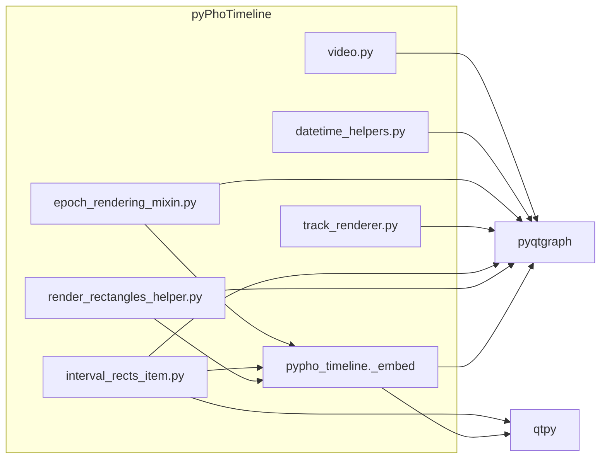

# Embed pyPhoPlaceCellAnalysis Dependencies and Remove Dependency

## Dependency map (immediate and downstream)

**Immediate imports in pyPhoTimeline:**


| Consumer file                                                                                                                                                                       | What is imported from pyphoplacecellanalysis                                                                                                      |
| ----------------------------------------------------------------------------------------------------------------------------------------------------------------------------------- | ------------------------------------------------------------------------------------------------------------------------------------------------- |
| [pypho_timeline/rendering/datasources/specific/video.py](c:\Users\pho\repos\EmotivEpoc\ACTIVE_DEV\pyPhoTimeline\pypho_timeline\rendering\datasources\specific\video.py)             | `External.pyqtgraph` as `pg`                                                                                                                      |
| [pypho_timeline/utils/datetime_helpers.py](c:\Users\pho\repos\EmotivEpoc\ACTIVE_DEV\pyPhoTimeline\pypho_timeline\utils\datetime_helpers.py)                                         | `External.pyqtgraph`, `DateAxisItem`                                                                                                              |
| [pypho_timeline/rendering/mixins/epoch_rendering_mixin.py](c:\Users\pho\repos\EmotivEpoc\ACTIVE_DEV\pyPhoTimeline\pypho_timeline\rendering\mixins\epoch_rendering_mixin.py)         | `IntervalDatasource`, `General2DRenderTimeEpochs`, `ReprPrintableItemMixin`                                                                       |
| [pypho_timeline/rendering/graphics/track_renderer.py](c:\Users\pho\repos\EmotivEpoc\ACTIVE_DEV\pyPhoTimeline\pypho_timeline\rendering\graphics\track_renderer.py)                   | `External.pyqtgraph` as `pg`                                                                                                                      |
| [pypho_timeline/rendering/graphics/interval_rects_item.py](c:\Users\pho\repos\EmotivEpoc\ACTIVE_DEV\pyPhoTimeline\pypho_timeline\rendering\graphics\interval_rects_item.py)         | `External.pyqtgraph` (pg, QtCore, QtGui, QtWidgets), `LegendItem.ItemSample`, `LegendItem`, `ReprPrintableItemMixin`, `CustomRectBoundedTextItem` |
| [pypho_timeline/rendering/helpers/render_rectangles_helper.py](c:\Users\pho\repos\EmotivEpoc\ACTIVE_DEV\pyPhoTimeline\pypho_timeline\rendering\helpers\render_rectangles_helper.py) | `External.pyqtgraph`, `IntervalDatasource`                                                                                                        |
| [testing_notebook.ipynb](c:\Users\pho\repos\EmotivEpoc\ACTIVE_DEV\pyPhoTimeline\testing_notebook.ipynb)                                                                             | `External.pyqtgraph` as `pg`                                                                                                                      |


**Downstream:** No other packages in the workspace depend on pyPhoTimeline’s importing pyphoplacecellanalysis; the only dependency to remove is in pyPhoTimeline itself.

---

## Strategy

- **Do not** copy the entire `External/pyqtgraph` tree from pyPhoPlaceCellAnalysis (large vendored fork).
- **Do** use **upstream `pyqtgraph`** (already in pyPhoTimeline’s dependencies) and **qtpy** for Qt bindings.
- **Do** add minimal **local** implementations inside pyPhoTimeline for:
  - `IntervalsDatasource` (pandas + Qt signal, no neuropy)
  - `General2DRenderTimeEpochs` (only `_update_df_visualization_columns` and `build_render_time_epochs_datasource` for DataFrame/tuple)
  - `ReprPrintableItemMixin`
  - Optional: minimal `CustomRectBoundedTextItem` or keep existing stub if labels are non‑critical.

---

## Implementation plan

### 1. Add embedded “vendored” modules under pyPhoTimeline

Create a small internal package, e.g. `pypho_timeline._embed`, to hold copied/simplified code so it’s clear what was inlined.

- **1.1 ReprPrintableItemMixin**  
  - Add `pypho_timeline/_embed/repr_printable_mixin.py` (or `pypho_timeline/utils/mixins/repr_printable_mixin.py`).  
  - Copy the implementation from [pyPhoPlaceCellAnalysis ReprPrintableWidgetMixin](H:\TEMP\Spike3DEnv_ExploreUpgrade\Spike3DWorkEnv\pyPhoPlaceCellAnalysis\src\pyphoplacecellanalysis\GUI\PyQtPlot\Widgets\Mixins\ReprPrintableWidgetMixin.py) (small, no external deps).  
  - Export as `ReprPrintableItemMixin`.
- **1.2 IntervalsDatasource (minimal)**  
  - Add `pypho_timeline/_embed/interval_datasource.py`.  
  - Implement a minimal `IntervalsDatasource` that:
    - Subclasses `QtCore.QObject` (use qtpy), has `source_data_changed_signal = QtCore.Signal(object)`.
    - Holds a pandas DataFrame with required columns `t_start`, `t_duration` (and optional `t_end`, `series_vertical_offset`, `series_height`, `pen`, `brush`).
    - Exposes `df` (getter/setter; setter emits `source_data_changed_signal`).
    - Has `custom_datasource_name`, `update_visualization_properties(callable)`, `get_updated_data_window(new_start, new_end)`, `total_df_start_end_times`.
    - Supports optional column synonym renaming (e.g. start/begin -> t_start, duration -> t_duration) **without** neuropy; implement a small local helper or dict-driven rename.
  - Do **not** depend on neuropy, BaseDatasource, or pyphocorehelpers; keep only pandas + Qt.
- **1.3 General2DRenderTimeEpochs (subset)**  
  - Add `pypho_timeline/_embed/general_2d_render_time_epochs.py`.  
  - Implement only what epoch_rendering_mixin and update_rendered_intervals_visualization_properties need:
    - `_update_df_visualization_columns(cls, active_df, y_location=None, height=None, pen_color=None, brush_color=None, **kwargs)` (same signature and behavior as in [Specific2DRenderTimeEpochs](H:\TEMP\Spike3DEnv_ExploreUpgrade\Spike3DWorkEnv\pyPhoPlaceCellAnalysis\src\pyphoplacecellanalysis\GUI\PyQtPlot\Widgets\Mixins\RenderTimeEpochs\Specific2DRenderTimeEpochs.py)).
    - `build_render_time_epochs_datasource(cls, active_epochs_obj, **kwargs)` that accepts **pd.DataFrame** or **(t_starts, t_durations, values)** tuple and returns the minimal `IntervalsDatasource` from 1.2, adding default viz columns (e.g. via a default formatter) when missing.
  - Use `pyqtgraph` for `pg.mkPen` / `pg.mkBrush`. No Epoch, Laps, DataSession, or neuropy.
- **1.4 CustomRectBoundedTextItem (optional)**  
  - Either: add `pypho_timeline/_embed/custom_rect_bounded_text_item.py` and copy/adapt [AlignableTextItem](H:\TEMP\Spike3DEnv_ExploreUpgrade\Spike3DWorkEnv\pyPhoPlaceCellAnalysis\src\pyphoplacecellanalysis\External\pyqtgraph_extensions\graphicsItems\TextItem\AlignableTextItem.py) to use `import pyqtgraph as pg` and qtpy, dropping SelectableItemMixin if not needed.  
  - Or: keep the existing stub in [interval_rects_item.py](c:\Users\pho\repos\EmotivEpoc\ACTIVE_DEV\pyPhoTimeline\pypho_timeline\rendering\graphics\interval_rects_item.py) (lines 34–44) and only switch its imports to local embed.  
  - Recommend starting with the existing stub; only add a full implementation if label positioning is required.

### 2. Switch all pyqtgraph and Qt imports to upstream/qtpy

- **2.1** Replace every `import pyphoplacecellanalysis.External.pyqtgraph as pg` with `import pyqtgraph as pg`.
- **2.2** Replace every `from pyphoplacecellanalysis.External.pyqtgraph import ...` with:
  - `from pyqtgraph import DateAxisItem` (or `import pyqtgraph as pg` then `pg.DateAxisItem`) where needed.
  - For Qt: use `from qtpy import QtCore, QtGui, QtWidgets` (or from `pyqtgraph.Qt` if the project prefers a single backend; qtpy is already used in epoch_rendering_mixin).
- **2.3** Replace `from pyphoplacecellanalysis.External.pyqtgraph.graphicsItems.LegendItem import ItemSample, LegendItem` with `from pyqtgraph.graphicsItems.LegendItem import ItemSample, LegendItem`.

**Files to update:**

- [pypho_timeline/rendering/datasources/specific/video.py](c:\Users\pho\repos\EmotivEpoc\ACTIVE_DEV\pyPhoTimeline\pypho_timeline\rendering\datasources\specific\video.py): `import pyqtgraph as pg`. Fix `pg.QtCore.QRectF` to use qtpy or `pg.Qt` if that’s what pyqtgraph exposes.
- [pypho_timeline/utils/datetime_helpers.py](c:\Users\pho\repos\EmotivEpoc\ACTIVE_DEV\pyPhoTimeline\pypho_timeline\utils\datetime_helpers.py): use `import pyqtgraph as pg` and `from pyqtgraph import DateAxisItem` (or equivalent); keep AM/PM formatting in a subclass.
- [pypho_timeline/rendering/mixins/epoch_rendering_mixin.py](c:\Users\pho\repos\EmotivEpoc\ACTIVE_DEV\pyPhoTimeline\pypho_timeline\rendering\mixins\epoch_rendering_mixin.py): remove try/except imports of IntervalsDatasource, General2DRenderTimeEpochs, ReprPrintableItemMixin; import from `pypho_timeline._embed` (or chosen location).
- [pypho_timeline/rendering/graphics/track_renderer.py](c:\Users\pho\repos\EmotivEpoc\ACTIVE_DEV\pyPhoTimeline\pypho_timeline\rendering\graphics\track_renderer.py): `import pyqtgraph as pg`.
- [pypho_timeline/rendering/graphics/interval_rects_item.py](c:\Users\pho\repos\EmotivEpoc\ACTIVE_DEV\pyPhoTimeline\pypho_timeline\rendering\graphics\interval_rects_item.py): pg and Qt from pyqtgraph/qtpy; ItemSample, LegendItem from pyqtgraph; ReprPrintableItemMixin from local embed; CustomRectBoundedTextItem from local embed or keep stub.
- [pypho_timeline/rendering/helpers/render_rectangles_helper.py](c:\Users\pho\repos\EmotivEpoc\ACTIVE_DEV\pyPhoTimeline\pypho_timeline\rendering\helpers\render_rectangles_helper.py): `import pyqtgraph as pg`; IntervalsDatasource from local embed.
- [testing_notebook.ipynb](c:\Users\pho\repos\EmotivEpoc\ACTIVE_DEV\pyPhoTimeline\testing_notebook.ipynb): replace External.pyqtgraph with pyqtgraph in the import cell.

### 3. Epoch rendering mixin behavior (DataFrame path)

- In [epoch_rendering_mixin.py](c:\Users\pho\repos\EmotivEpoc\ACTIVE_DEV\pyPhoTimeline\pypho_timeline\rendering\mixins\epoch_rendering_mixin.py), `add_rendered_intervals` currently converts a DataFrame to a datasource via `General2DRenderTimeEpochs.build_render_time_epochs_datasource(interval_df)` and optionally uses `TimeColumnAliasesProtocol.renaming_synonym_columns_if_needed` (neuropy).  
- In the embedded design:
  - Implement column synonym renaming in the minimal IntervalsDatasource or in a small helper in `_embed` (no neuropy).
  - Call the embedded `General2DRenderTimeEpochs.build_render_time_epochs_datasource(interval_df)` so that DataFrame input still works without neuropy.

### 4. Remove pyphoplacecellanalysis from the project

- In [pyproject.toml](c:\Users\pho\repos\EmotivEpoc\ACTIVE_DEV\pyPhoTimeline\pyproject.toml): remove the `pyphoplacecellanalysis` dependency and remove the `[tool.uv.sources]` entry for it.
- Run `uv sync --all-extras` (or equivalent) and fix any remaining imports or tests.
- Optionally add a short note in README or docs that timeline no longer depends on pyPhoPlaceCellAnalysis and that minimal interval/epoch helpers are embedded.

### 5. Testing and sanity checks

- Run tests if present; otherwise run the timeline UI and open a session that uses interval rendering, DataFrame intervals, and datetime axis (AM/PM) to confirm nothing regresses.
- Ensure video track, track_renderer, and epoch_rendering_mixin still work with the new imports and embedded classes.

---

## File layout (suggested)

```
pypho_timeline/
  _embed/                          # or utils/embed, optional
    __init__.py                    # export ReprPrintableItemMixin, IntervalsDatasource, General2DRenderTimeEpochs
    repr_printable_mixin.py
    interval_datasource.py
    general_2d_render_time_epochs.py
    # custom_rect_bounded_text_item.py  # optional
```

Alternatively, place mixin in `utils/mixins/`, interval_datasource and general_2d in `rendering/datasources/` or `rendering/embed/` to match existing structure.

---

## Dependency diagram (after change)




---

## Risks and notes

- **pyqtgraph version:** PyPhoPlaceCellAnalysis ships a vendored pyqtgraph (0.12.4.dev0). Upstream pyqtgraph may have slightly different APIs (e.g. DateAxisItem constructor, LegendItem). Use the project’s pinned pyqtgraph version and adjust imports/API if needed.
- **video.py:** Uses `pg.QtCore.QRectF` and `pg.mkColor` etc.; ensure these exist on upstream `pg` (they do in standard pyqtgraph). If pyqtgraph uses a different Qt wrapper, use qtpy for Qt types.
- **neuropy optional path:** If `TimeColumnAliasesProtocol.renaming_synonym_columns_if_needed` is still desired when neuropy is installed, it can remain as an optional try/import in epoch_rendering_mixin; the embedded path should work without it by implementing a small local synonym rename for interval columns only.

