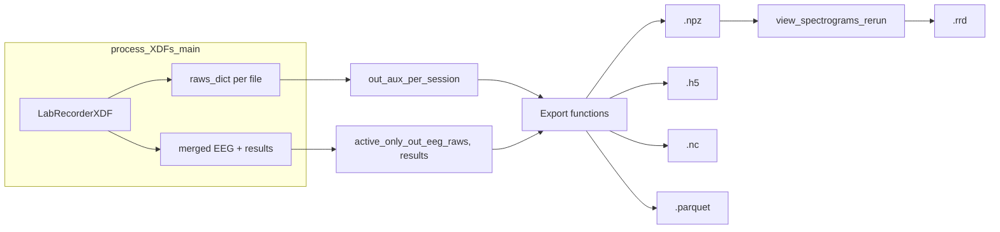

# Integrate Raw EEG, Motion, and Text Log into Spectrogram Export Files

## Current state

- **Pipeline** ([main_analyze_run.py](examples_jupyter/main_analyze_run.py)): `process_XDFs_main` loads each XDF via `LabRecorderXDF.init_from_lab_recorder_xdf_file`, which builds `raws_dict` keyed by `DataModalityType` (EEG, MOTION, PHO_LOG_TO_LSL). Only merged EEG and `stream_infos`/`results` are returned; motion and text log are never passed out.
- **Exports**: Four functions write spectrograms (and session metadata) to the same paths: `export_spectrograms_for_rerun` (NPZ), `export_spectrograms_hdf5`, `export_spectrograms_netcdf`, `export_spectrograms_parquet`. Each iterates `active_only_out_eeg_raws` and `results` only.
- **Rerun viewer** ([view_spectrograms_rerun.py](rerun/view_spectrograms_rerun.py)): Loads the NPZ and logs only spectrograms per session with `meas_date_sec` as time.

**Data sources** (from [xdf_files.py](src/phoofflineeeganalysis/analysis/xdf_files.py)):

- **Motion**: `raws_dict[DataModalityType.MOTION.value]` is a list of `mne.io.RawArray` (one per XDF). Each has `.get_data()`, `.times`, `info['ch_names']`, and `meas_date`/stream datetime for alignment.
- **Text log**: `raws_dict[DataModalityType.PHO_LOG_TO_LSL.value]` is a list of `mne.Annotations` (onset in seconds, duration, description = strings, `orig_time` for absolute time).
- **Raw EEG**: Already available as `a_raw` (MNE Raw) with `.get_data()`, `.times`, `info['meas_date']`, `ch_names`, `sfreq`.

## Architecture (high level)

## Implementation plan

### 1. Pipeline: return per-session auxiliary data

**File**: [examples_jupyter/main_analyze_run.py](examples_jupyter/main_analyze_run.py)

- In `_subfn_process_single_xdf_file`, after building `eeg_raw` and `result`, also return the **raws_dict** for that XDF (same scope already has `raws_dict` from `_obj.datasets_dict`). Return signature: `(an_xdf_file_idx, eeg_raw, stream_infos, result, raws_dict)` (or `raws_dict` replaced by a minimal dict with only MOTION and PHO_LOG_TO_LSL lists to avoid carrying full EEG again).
- In the `ThreadPoolExecutor` result collection, store the fifth element into a list `_out_raws_dict` (or `_out_aux_per_session`) keyed by the same index; after filtering valid indices and reordering by sort_indices, keep a list `out_aux_per_session` aligned with `active_only_out_eeg_raws` and `results`.
- Update the return of `process_XDFs_main` to include this list, e.g. `return sso, xdf_dataset_indicies, _out_xdf_stream_infos_df, active_only_out_eeg_raws, results, out_aux_per_session`.
- In the `if __name__ == "__main__"` block, unpack the new return value and pass `out_aux_per_session` (or a name like `session_aux_data_list`) into each of the four export calls. Use `None` or empty list for backward compatibility in export (see below).

**Design note**: Prefer returning the same `raws_dict` (or a shallow copy) per session so export logic can extract arrays and annotations in one place. Keys: `DataModalityType.MOTION.value`, `DataModalityType.PHO_LOG_TO_LSL.value` (and optionally EEG if we want a single source of truth; currently we already have `active_only_out_eeg_raws`).

### 2. Export functions: add raw EEG, motion, and text to same files

**File**: [examples_jupyter/main_analyze_run.py](examples_jupyter/main_analyze_run.py)

Add an optional parameter to all four export functions, e.g. `session_aux_data_list: Optional[List[Dict]] = None`. When `None` or missing for a session, omit raw/motion/text blocks for that session (or write empty arrays so structure is consistent).

**Per-session extraction helper** (internal or in same file):

- **Raw EEG**: From `a_raw`: `data = a_raw.get_data()` (n_ch, n_times), `times = a_raw.times`, `meas_date_sec` (already computed), `channel_names`, `sfreq`.
- **Motion**: From `session_aux_data_list[idx]`: get list of Raw from key `DataModalityType.MOTION.value`; if non-empty, take first (or concatenate if multiple). Extract `data = raw.get_data()`, `times = raw.times`, `channel_names`, reference datetime from `raw.info.get('meas_date')` or device_info stream_start_datetime.
- **Text**: From same dict, key `DataModalityType.PHO_LOG_TO_LSL.value`: list of `mne.Annotations`. For each, `onset` (seconds), `description` (strings). Optionally store `orig_time` (e.g. as ISO string or seconds) for alignment. If multiple annotation objects, merge onset/description (and orig_time if needed).

**NPZ** (`export_spectrograms_for_rerun`):

- Add per-session keys, e.g. `s{idx}_eeg_data`, `s{idx}_eeg_times`, `s{idx}_motion_data`, `s{idx}_motion_times`, `s{idx}_motion_ch_names`, `s{idx}_text_onset`, `s{idx}_text_description` (numpy object arrays where needed). Include `s{idx}_motion_meas_date_sec` and `s{idx}_text_orig_time_sec` (or similar) for alignment. Omit keys when modality is missing for that session.

**HDF5** (`export_spectrograms_hdf5`):

- Under each `sessions/session_XXX/`: add datasets `eeg_raw`, `eeg_times`; `motion_raw`, `motion_times`, `motion_ch_names`; `text_onset`, `text_description` (vlen string for text). Add group attributes for alignment (e.g. `eeg_meas_date_iso`, `motion_meas_date_iso`, `text_orig_time_iso`). Create datasets only when data exist.

**NetCDF** (`export_spectrograms_netcdf`):

- Add variables for raw EEG, motion, and text. Use NaN-padding for variable-length sessions (same pattern as existing spectrogram padding). Store alignment as session-level attributes or coordinates (e.g. `eeg_meas_date_iso`, `motion_meas_date_iso`, `text_orig_time_iso` per session).

**Parquet** (`export_spectrograms_parquet`):

- One row per session: add columns for raw EEG (e.g. list of list or nested list for n_ch x n_times), eeg_times list; motion_data, motion_times, motion_ch_names; text_onset list, text_description list. Include alignment columns (e.g. meas_date_iso, motion_meas_date_iso, text_orig_time_iso).

**Backward compatibility**: If `session_aux_data_list` is `None` or `len(session_aux_data_list) != len(active_only_out_eeg_raws)`, treat as no auxiliary data and only write spectrograms (current behavior). This keeps old call sites working.

### 3. Rerun viewer: log raw EEG, motion, and text from NPZ

**File**: [rerun/view_spectrograms_rerun.py](rerun/view_spectrograms_rerun.py)

- After loading the NPZ, check for presence of raw/motion/text keys per session (e.g. `f"s{idx}_eeg_data" in data` or similar).
- **Spectrograms**: Keep current behavior (session time from `s{idx}_meas_date_sec`, log images per channel).
- **Raw EEG**: If `s{idx}_eeg_data` exists, log time series: use `s{idx}_eeg_times` and `s{idx}_meas_date_sec` to derive timestamps; log each channel as `rr.LineSeries` (or equivalent) under e.g. `sessions/session_{idx}/eeg_raw/{ch_name}`. Rerun expects time series with a time axis; use `rr.set_time_seconds("session_time", s{idx}_eeg_times + offset)` and log series.
- **Motion**: If `s{idx}_motion_data` exists, same idea: log motion channels as line series under `sessions/session_{idx}/motion/` with session time alignment.
- **Text**: If `s{idx}_text_onset` / `s{idx}_text_description` exist, log at the corresponding times (e.g. `rr.set_time_seconds("session_time", text_onset[i] + session_offset)` then `rr.log("sessions/session_{idx}/text_log", rr.TextLog(text_description[i]))`). Confirm Rerun API for text at specific timestamps (e.g. `rr.TextLog` with timeline).

Use the same `session_time` timeline and same session index ordering as spectrograms so all data stay aligned in the viewer.

### 4. Call-site and docstring updates

- **main_analyze_run.py** `if __name__ == "__main__"`: Unpack `out_aux_per_session` from `process_XDFs_main`; pass it into `export_spectrograms_for_rerun`, `export_spectrograms_hdf5`, `export_spectrograms_netcdf`, `export_spectrograms_parquet`. Docstrings for the four export functions should state that when `session_aux_data_list` is provided, raw EEG, motion, and text log (with datetime/alignment) are also written to the same file.
- **view_spectrograms_rerun.py**: Docstring at top should mention that the NPZ may contain raw EEG, motion, and text log and that the script will log them to Rerun when present.

### 5. Edge cases and consistency

- **Missing modalities**: A session may have no motion or no text; export and viewer must skip or write empty arrays and not fail.
- **Alignment**: Use one reference per session (e.g. EEG `meas_date`) and store all other datetimes (motion, text orig_time) as attributes so consumers can align to a common clock. In Rerun, map all to the same `session_time` using the session’s reference and relative times.
- **DataModalityType import**: Use existing import in main_analyze_run (e.g. from `SavedSessionsProcessor` or `xdf_files`) when accessing `DataModalityType.MOTION.value` and `DataModalityType.PHO_LOG_TO_LSL.value` during extraction.

## Files to change (summary)

| File                                                                         | Changes                                                                                                                                                                                                                                        |
| ---------------------------------------------------------------------------- | ---------------------------------------------------------------------------------------------------------------------------------------------------------------------------------------------------------------------------------------------- |
| [examples_jupyter/main_analyze_run.py](examples_jupyter/main_analyze_run.py) | Return `raws_dict` from worker; collect `out_aux_per_session`; add `session_aux_data_list` to all four export functions and write raw EEG, motion, text (+ alignment) into NPZ/HDF5/NetCDF/Parquet; update `__main__` unpack and export calls. |
| [rerun/view_spectrograms_rerun.py](rerun/view_spectrograms_rerun.py)         | Read optional NPZ keys for eeg_raw, motion, text; log them to Rerun with session time alignment; update docstring.                                                                                                                             |

## Optional / future

- **EEG annotations**: The notebook already extracts “comments” from `a_raw.annotations`; those could be added to the export as a second text source (or merged with PHO_LOG in the export schema) if desired in a follow-up.
- **Downsampling**: Raw EEG can be large; consider optional downsampling or max length when writing to NPZ/Parquet to keep file size manageable.

