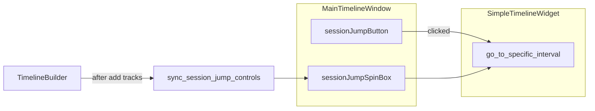

# Footer session jump (spinbox + button)

## Context

- The footer is [`MainTimelineWindow.ui`](C:/Users/pho/repos/EmotivEpoc/ACTIVE_DEV/pyPhoTimeline/pypho_timeline/widgets/TimelineWindow/MainTimelineWindow.ui): `footerBar` / `footerLayout` is currently **horizontalSpacer → Show Log → Refresh files**, which pushes controls to the RHS.
- [`MainTimelineWindow.py`](C:/Users/pho/repos/EmotivEpoc/ACTIVE_DEV/pyPhoTimeline/pypho_timeline/widgets/TimelineWindow/MainTimelineWindow.py) wires the log toggle and refresh button in `initUI()`.
- Session-style navigation already exists on the timeline: [`SimpleTimelineWidget.go_to_specific_interval`](C:/Users/pho/repos/EmotivEpoc/ACTIVE_DEV/pyPhoTimeline/pypho_timeline/widgets/simple_timeline_widget.py) reads `get_overview_intervals()` from a named track (default **`'EEG_Epoc X'`**, same as `_add_tracks_to_timeline` / `EEG_{stream_name}` naming) and calls `update_window(t_start, t_end)` for that row. Indices are **0-based** (`iloc`), per your choice.

## UI changes ([`MainTimelineWindow.ui`](C:/Users/pho/repos/EmotivEpoc/ACTIVE_DEV/pyPhoTimeline/pypho_timeline/widgets/TimelineWindow/MainTimelineWindow.ui))

Insert **before** `horizontalSpacer` (LHS of the bar):

1. `QLabel` — short caption, e.g. **Session:** (or **Idx:** to save space).
2. `QSpinBox` — name e.g. `sessionJumpSpinBox`, `minimum=0`, `maximum=0` initially, reasonable `minimumSize` height ~24 to match existing buttons.
3. `QPushButton` — name e.g. `sessionJumpButton`, text e.g. **Go** or **Jump**.

Keep the existing spacer so log/refresh stay right-aligned.

## Window logic ([`MainTimelineWindow.py`](C:/Users/pho/repos/EmotivEpoc/ACTIVE_DEV/pyPhoTimeline/pypho_timeline/widgets/TimelineWindow/MainTimelineWindow.py))

- Add a **single constant** for the intervals track id (default `'EEG_Epoc X'`) so it stays aligned with `go_to_specific_interval`’s default and is easy to change later if needed.
- **`sync_session_jump_controls()`** (public so the builder can call it):
  - Resolve `tw = self.timeline_widget`; if missing, set spin max `0`, disable button, return.
  - `_, _, ds = tw.get_track_tuple(<track_id>)`; if `ds` is None or has no `get_overview_intervals`, disable and max=0.
  - `n = len(ds.get_overview_intervals())`; if `n == 0`, same; else `spin.setMaximum(n - 1)`, enable button (clamp current value if needed).
- **`_on_session_jump_clicked()`**:
  - Optionally call `sync_session_jump_controls()` first (cheap) or trust sync; then if enabled, `tw.go_to_specific_interval(self.sessionJumpSpinBox.value(), specific_intervals_ds_identifier=<track_id>)`.
  - Wrap failures in try/except: log via existing rendering logger (or `QMessageBox` only if you want visible feedback — prefer minimal log to match existing patterns).
- In **`initUI()`**: connect `sessionJumpButton.clicked` → `_on_session_jump_clicked`; call `sync_session_jump_controls()` once (timeline may be empty until builder runs).

## Builder hooks ([`timeline_builder.py`](C:/Users/pho/repos/EmotivEpoc/ACTIVE_DEV/pyPhoTimeline/pypho_timeline/timeline_builder.py))

After tracks are attached to the timeline, refresh the footer so the spin max matches the loaded overview rows:

1. After **`_add_tracks_to_timeline`** in **`build_from_datasources`** (currently ~line 986, right after `main_window` / `timeline` are set).
2. After **`_add_tracks_to_timeline`** in **`update_timeline`** (~line 1088).

Use a small internal helper, e.g. `_sync_main_window_session_jump_controls()`, that no-ops if `_current_main_window` is None and otherwise calls `main_window.sync_session_jump_controls()`. Initial build should use the local `main_window` reference; `update_timeline` should use `self._current_main_window` (same object the builder already tracks).

## Edge cases

- **No EEG / wrong track name**: controls disabled; no crash.
- **Refresh adds tracks**: `update_timeline` path re-syncs max.
- **MainTimelineWindow without builder**: spin stays 0 unless something else calls `sync_session_jump_controls()` (acceptable; same class comment as refresh button requiring builder/callback).

## Files touched

- [`pyPhoTimeline/pypho_timeline/widgets/TimelineWindow/MainTimelineWindow.ui`](C:/Users/pho/repos/EmotivEpoc/ACTIVE_DEV/pyPhoTimeline/pypho_timeline/widgets/TimelineWindow/MainTimelineWindow.ui)
- [`pyPhoTimeline/pypho_timeline/widgets/TimelineWindow/MainTimelineWindow.py`](C:/Users/pho/repos/EmotivEpoc/ACTIVE_DEV/pyPhoTimeline/pypho_timeline/widgets/TimelineWindow/MainTimelineWindow.py)
- [`pyPhoTimeline/pypho_timeline/timeline_builder.py`](C:/Users/pho/repos/EmotivEpoc/ACTIVE_DEV/pyPhoTimeline/pypho_timeline/timeline_builder.py)

No notebook edits. No new dependencies.
