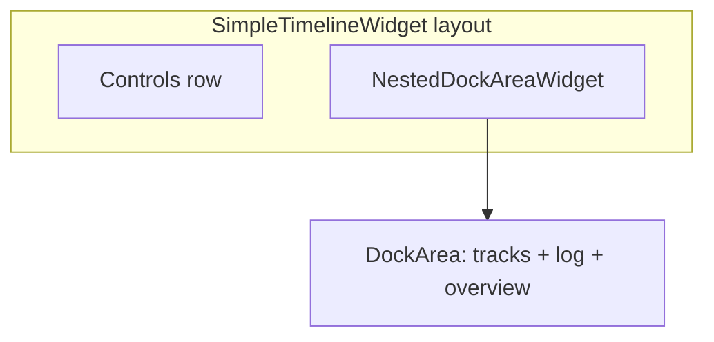

# Timeline overview strip in a dock

## Context

- Today [`add_timeline_overview_strip`](c:\Users\pho\repos\EmotivEpoc\ACTIVE_DEV\pyPhoTimeline\pypho_timeline\widgets\simple_timeline_widget.py) creates a [`TimelineOverviewStrip`](c:\Users\pho\repos\EmotivEpoc\ACTIVE_DEV\pyPhoTimeline\pypho_timeline\widgets\timeline_overview_strip.py) and inserts it into the main `QVBoxLayout` (`insertWidget` / `addWidget`).
- The rest of the timeline UI uses **pyqtgraph** docks on [`NestedDockAreaWidget`](c:\Users\pho\repos\EmotivEpoc\ACTIVE_DEV\pyPhoTimeline\pypho_timeline\docking\nested_dock_area_widget.py) via [`DynamicDockDisplayAreaContentMixin.add_display_dock`](c:\Users\pho\repos\EmotivEpoc\ACTIVE_DEV\pyPhoTimeline\pypho_timeline\docking\dynamic_dock_display_area.py) (see [`TimelineBuilder._embed_log_widget_in_timeline`](c:\Users\pho\repos\EmotivEpoc\ACTIVE_DEV\pyPhoTimeline\pypho_timeline\timeline_builder.py) ~168).

## Implementation (single file: [`simple_timeline_widget.py`](c:\Users\pho\repos\EmotivEpoc\ACTIVE_DEV\pyPhoTimeline\pypho_timeline\widgets\simple_timeline_widget.py))

1. **Replace layout insertion with `add_display_dock`**
   - Use `self.ui.dynamic_docked_widget_container.add_display_dock(...)` with a stable identifier, e.g. `identifier='timeline_overview_strip'`, so `find_display_dock('timeline_overview_strip')` works (same as `'log_widget'`).
   - Pass the existing `strip` as `widget=`. Keep `self.ui.timeline_overview_strip = strip` so callers and notebooks that use `timeline.ui.timeline_overview_strip` stay unchanged.
   - Optionally unpack and store the returned `Dock` on e.g. `self.ui.timeline_overview_strip_dock` for debugging; not required for behavior.

2. **`dockAddLocationOpts` from `position`**
   - Map to pyqtgraph [`DockArea.addDock`](c:\Users\pho\repos\EmotivEpoc\ACTIVE_DEV\pyPhoTimeline\pypho_timeline\EXTERNAL\pyqtgraph\dockarea\DockArea.py) semantics (edge of stack, not Qt main-window docking):
     - **`bottom`** → `['bottom']` — matches default [`build_from_xdf_files`](c:\Users\pho\repos\EmotivEpoc\ACTIVE_DEV\pyPhoTimeline\pypho_timeline\timeline_builder.py) after tracks (and after log is embedded in `build_from_datasources`, overview ends up bottommost in the dock stack, analogous to the old “below the dock area” placement).
     - **`below_controls`** → `['top']` — first row of the dock stack, directly under the toolbar (controls stay outside [`setupUI`](c:\Users\pho\repos\EmotivEpoc\ACTIVE_DEV\pyPhoTimeline\pypho_timeline\widgets\simple_timeline_widget.py) as today).
     - **`top`** → `['top']` — **behavior change vs legacy**: old code used `insertWidget(0, strip)`, which placed the strip **above** the control row. A dock cannot sit above that row without restructuring the outer layout. Document in the docstring that `top` now means “top of the dock stack” (same edge placement as `below_controls` when no relative dock is used).

3. **`dockSize` and `display_config`**
   - Use a reasonable initial size similar to the log dock, e.g. `(800, 200)` or tie height to `row_height_px` (e.g. `max(120, row_height_px * 4 + 28)`); `TimelineOverviewStrip.rebuild` already sets `minimumHeight`.
   - Pass a `FigureWidgetDockDisplayConfig` (already used elsewhere in [`SpecificDockWidgetManipulatingMixin`](c:\Users\pho\repos\EmotivEpoc\ACTIVE_DEV\pyPhoTimeline\pypho_timeline\docking\specific_dock_widget_mixin.py)) with a readable title (e.g. “Overview”) and the same button/title-bar conventions as other figure docks, unless you prefer a minimal bar (`hideTitleBar` / `showCloseButton`) for a minimap look.

4. **Parent widget**
   - Align with log embedding: construct `TimelineOverviewStrip(..., parent=None)` or let the `Dock` own reparenting; avoid requiring `parent=self` if it fights dock ownership.

5. **Idempotency**
   - Early return when `self.ui.timeline_overview_strip` is already set (unchanged), or additionally guard with `find_display_dock('timeline_overview_strip')` if you want belt-and-suspenders.

6. **No changes** to [`timeline_overview_strip.py`](c:\Users\pho\repos\EmotivEpoc\ACTIVE_DEV\pyPhoTimeline\pypho_timeline\widgets\timeline_overview_strip.py) unless sizing in a dock reveals a policy issue (unlikely).

7. **Small bugfix (same file, optional but recommended)**
   - [`dock_manager_widget`](c:\Users\pho\repos\EmotivEpoc\ACTIVE_DEV\pyPhoTimeline\pypho_timeline\widgets\simple_timeline_widget.py) / `dock_container` currently reference `timeline.ui` (undefined); they should return `self.ui.dynamic_docked_widget_container` so `DynamicDockDisplayAreaOwningMixin` works if anything calls those properties.

## Docs / consumers

- Update the docstring of `add_timeline_overview_strip` to describe dock placement and the `top` semantic change.
- Public API still returns the `TimelineOverviewStrip` instance; [`timeline_builder.py`](c:\Users\pho\repos\EmotivEpoc\ACTIVE_DEV\pyPhoTimeline\pypho_timeline\timeline_builder.py) call site (`position='bottom'`) needs no change.
