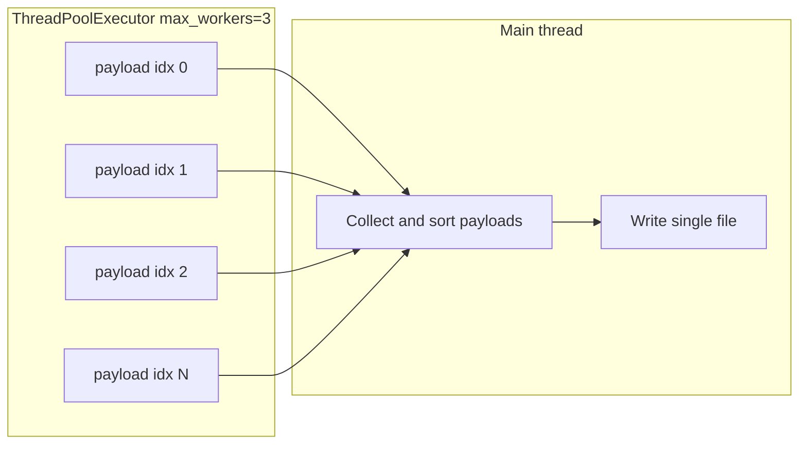

# Parallelize session export (3 threads)

## Current behavior

In [main_analyze_run.py](examples_jupyter/main_analyze_run.py), all four export functions (`export_spectrograms_for_rerun`, `export_spectrograms_hdf5`, `export_spectrograms_netcdf`, `export_spectrograms_parquet`) loop over sessions sequentially. For each session they:

1. Compute spectrogram arrays (freqs, times, Sxx_stack, channel_names) and metadata (meas_date_sec/iso, duration_s, sfreq_hz, n_channels, xdf_filename).
2. Optionally call `_extract_session_aux_for_export(a_raw, session_aux_data_list[idx])` for raw EEG, motion, and text.
3. Write or accumulate that session’s data into the single output file.

The heavy work is step 1–2 (CPU and memory); step 3 is either a dict update (NPZ), group writes (HDF5), or list append (NetCDF/Parquet). File I/O for NPZ/HDF5/NetCDF/Parquet must stay single-threaded (one file per format).

## Approach

- **Parallelize only per-session computation.** Use `ThreadPoolExecutor(max_workers=3)` to compute each session’s “payload” in parallel, then in the main thread merge payloads and perform the single-threaded file write.
- **Single shared worker.** Add one helper that, given a single session’s inputs, returns a single payload dict (or `None` if the session is skipped). All four exporters will use this payload so we avoid duplicating spectrogram/aux logic and keep one place to change if payload shape evolves.

## Implementation

### 1. Add a per-session payload helper

**File:** [examples_jupyter/main_analyze_run.py](examples_jupyter/main_analyze_run.py)

Add a function used only by the export pipeline (e.g. after `_extract_session_aux_for_export`):

- **Name:** `_compute_session_export_payload(idx, a_raw, a_result, session_aux_data, freq_min, freq_max, xdf_filename) -> Optional[Dict[str, Any]]`.
- **Behavior:**  
  - If `a_result is None` or `"spectogram" not in a_result`, return `None`.  
  - Otherwise compute the same spectrogram and metadata as today (meas_date_sec/iso, freqs, times, Sxx_stack, channel_names, duration_s, sfreq_hz, n_channels).  
  - If `session_aux_data is not None`, set `payload["_aux"] = _extract_session_aux_for_export(a_raw, session_aux_data)`.  
  - Set `payload["xdf_filename"]` from the argument.  
  - Return the payload dict; on any exception, return `None` (and optionally log a short warn).
- **Returned keys:** At least `idx`, `channel_names`, `freqs`, `times`, `spectrogram` (Sxx_stack), `meas_date_sec`, `meas_date_iso`, `duration_s`, `sfreq_hz`, `n_channels`, `xdf_filename`, and optionally `_aux`.

This keeps all per-session logic in one place and makes the export loops thin: build list of args, run executor, collect and sort payloads, then assemble the file.

### 2. NPZ export (`export_spectrograms_for_rerun`)

- Build list of task args: for each `idx, (a_raw, a_result)` in `enumerate(zip(active_only_out_eeg_raws, results))`, append `(idx, a_raw, a_result, session_aux_data_list[idx] if use_aux else None, freq_min, freq_max, None)` (xdf_filename not needed for NPZ; can pass `None` or add to helper and ignore in NPZ).
- Run `ThreadPoolExecutor(max_workers=3).submit(_compute_session_export_payload, *args)` for each task (or use `executor.map` with a wrapper that unpacks args).
- Collect results (e.g. `as_completed` or `map`), drop `None`, sort by `payload["idx"]`.
- Loop over sorted payloads: for each payload, fill `export_dict` with `s{idx}_meas_date_sec`, `s{idx}_channel_names`, `s{idx}_freqs`, `s{idx}_times`, `s{idx}_Sxx`, and if `_aux` present the same `s{idx}_eeg_`* / `s{idx}_motion_*` / `s{idx}_text_*` keys as today.
- Set `export_dict["session_indices"]` from the payloads’ `idx`.
- Call `np.savez_compressed(output_path, **export_dict)` unchanged.

### 3. HDF5 export (`export_spectrograms_hdf5`)

- Build the same list of task args (include `dataset_to_filename.get(idx)` for xdf_filename in the payload so HDF5 can attach it).
- Run the same 3-worker pool and collect sorted payloads.
- Keep the existing `with h5py.File(...)` and creation of root/sessions group and `dt_str`; replace the inner `for idx, (a_raw, a_result) in enumerate(...)` loop with a single loop over the sorted payloads. For each payload, create `session_{idx:03d}` and create datasets/attrs from the payload (spectrogram, freqs, times, channel_names, attrs; and if `_aux` in payload, add eeg_raw, motion_*, text_* as today). Use `payload["xdf_filename"]` for the attribute.

### 4. NetCDF export (`export_spectrograms_netcdf`)

- Build task args and run the same 3-worker pool; collect sorted payloads. Each payload already has the shape of a “session row” (spectrogram, freqs, times, channel_names, _aux, etc.).
- Replace the current “for idx, (a_raw, a_result) in enumerate(...): session_rows.append(row)” block with building `session_rows = [payload for payload in sorted_payloads]` (payloads are already row-like; ensure keys match what the rest of the function expects, e.g. `session_idx` → from `payload["idx"]`, and `_aux` present when use_aux).
- Keep the rest of the function unchanged: padding, `data_vars`, `coords`, `xr.Dataset`, `to_netcdf`. Ensure any code that reads `r["session_idx"]` or similar uses the payload keys (e.g. `payload["idx"]`).

### 5. Parquet export (`export_spectrograms_parquet`)

- Same idea: build args, run 3-worker pool, collect sorted payloads.
- Build `rows` from payloads: each payload becomes one row (session_idx, meas_date_iso, meas_date_sec, xdf_filename, sfreq_hz, duration_s, n_channels, channel_names, freqs.tolist(), times.tolist(), spectrogram.tolist(); and if `_aux` present, add eeg_data, motion_*, text_* columns as today).
- Then `pd.DataFrame.from_records(rows).to_parquet(...)` as now.

### 6. Thread count and executor usage

- Use a constant for the number of workers, e.g. `_EXPORT_MAX_WORKERS = 3`, at module level or near the export functions, and use `ThreadPoolExecutor(max_workers=_EXPORT_MAX_WORKERS)` in all four export functions. That keeps “3 threads” in one place and makes it easy to change later (e.g. via env or parameter).
- Reuse the same pattern in each export: create executor, submit/map tasks, collect and sort by `idx`, then run the existing “assemble and write” logic on the list of payloads.

### 7. Backward compatibility and edge cases

- If there are zero sessions (all payloads are `None`), keep current behavior: NPZ gets empty session_indices; HDF5 gets n_sessions=0; NetCDF/Parquet use the same empty/early-return paths as today.
- Preserve order of sessions by sorting collected payloads by `payload["idx"]` before building export_dict / session_rows / rows so output file contents stay deterministic and identical to the current single-threaded order.

## Files to change

| File                                                                         | Changes                                                                                                                                                                                                                                                                              |
| ---------------------------------------------------------------------------- | ------------------------------------------------------------------------------------------------------------------------------------------------------------------------------------------------------------------------------------------------------------------------------------ |
| [examples_jupyter/main_analyze_run.py](examples_jupyter/main_analyze_run.py) | Add `_compute_session_export_payload(...)` and `_EXPORT_MAX_WORKERS = 3`. In all four export functions, replace the sequential session loop with: build task list, run ThreadPoolExecutor(max_workers=3), collect and sort payloads, then assemble and write the file from payloads. |

## Summary

- One new helper: `_compute_session_export_payload` returning a single payload dict (or `None`) per session.
- All four exporters switch to: compute payloads in parallel with 3 threads, then single-threaded merge and write. No change to export file formats or to callers; only internal parallelization of per-session work.

