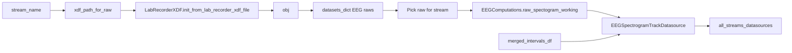

# Implement raw_xdf_processing mode (spectrogram TODO)

## Context

- **Where**: [stream_to_datasources.py](c:\Users\pho\repos\EmotivEpoc\ACTIVE_DEV\pyPhoTimeline\pypho_timeline\rendering\datasources\stream_to_datasources.py) inside `perform_process_all_streams_multi_xdf`, in the `stream_type.upper() == 'EEG'` branch when `enable_raw_xdf_processing` is True.
- **Existing bug**: Code uses `_obj` but the variable is named `obj` (line 406–409). Also `xdf_file_path` is not in scope at that point (only `file_path` exists inside the inner loop); the block runs per `stream_name`, so the path must be taken from `stream_file_pairs`.
- **Downstream**: [timeline_builder.py](c:\Users\pho\repos\EmotivEpoc\ACTIVE_DEV\pyPhoTimeline\pypho_timeline\timeline_builder.py) builds `active_datasource_list = list(active_datasources_dict.values())` and passes it to `build_from_datasources`. Adding a second entry to `all_streams_datasources` (e.g. `f"EEG_Spectrogram_{stream_name}"`) yields a second track automatically.

## Key references

- **Spectrogram computation**: [timeline_builder.py](c:\Users\pho\repos\EmotivEpoc\ACTIVE_DEV\pyPhoTimeline\pypho_timeline\timeline_builder.py) (FIF path) uses `EEGComputations.raw_spectogram_working(raw, nperseg=1024, noverlap=512)` and builds `EEGSpectrogramTrackDatasource(intervals_df=..., spectrogram_result=spec_result, custom_datasource_name=f"EEG_Spectrogram_{stream_name}")`.
- **LabRecorderXDF**: [PhoPyMNEHelper xdf_files.py](c:\Users\pho\repos\EmotivEpoc\ACTIVE_DEV\PhoPyMNEHelper\src\phopymnehelper\xdf_files.py) — `obj.datasets_dict` is `Dict[DataModalityType, List[mne.io.Raw]]`; keys are stored as enum `.value` (string), e.g. `DataModalityType.EEG.value` → `"EEG"`. So use `obj.datasets_dict.get("EEG", [])` (or import `DataModalityType` and use `.get(DataModalityType.EEG.value, [])`).
- **EEGSpectrogramTrackDatasource**: [eeg.py](c:\Users\pho\repos\EmotivEpoc\ACTIVE_DEV\pyPhoTimeline\pypho_timeline\rendering\datasources\specific\eeg.py) — constructor takes `intervals_df`, `spectrogram_result` (dict from `raw_spectogram_working`), and `custom_datasource_name`.

## Implementation plan

### 1. Fix variable and path scope

- Replace all `_obj` with `obj` in the `enable_raw_xdf_processing` block.
- Define the XDF path for this stream: e.g. `xdf_path_for_raw = stream_file_pairs[0][1]` (first file that contributed to this stream). Use `xdf_path_for_raw` when calling `LabRecorderXDF.init_from_lab_recorder_xdf_file(a_xdf_file=xdf_path_for_raw, ...)`.

### 2. Load LabRecorderXDF and handle OLDBUG

- Keep a single load per stream (using `xdf_path_for_raw`). Optionally wrap the load in try/except for the existing `ValueError: Date must be datetime object in UTC` (OLDBUG); on exception log a warning and skip spectrogram (do not fail the whole pipeline). Document that fixing the UTC date handling belongs in PhoPyMNEHelper if needed.

### 3. Get EEG raws and pick the one for this stream

- `raws_dict = obj.datasets_dict` (or get via `obj.datasets_dict.get("EEG", [])`).
- If the list has one Raw, use it. If multiple, either use the first Raw that corresponds to this stream (e.g. match by stream name in `obj.stream_infos` if available) or use the first Raw for a minimal first version. Matching by stream name is preferable when `stream_infos` has a name column and order aligns with `datasets_dict["EEG"]`.

### 4. Compute spectrogram and create spectrogram datasource

- Optional dependency: try importing `EEGComputations` from `phopymnehelper.EEG_data` (same as timeline_builder). If not available, skip spectrogram and log.
- For the chosen `raw`, call `EEGComputations.raw_spectogram_working(raw, nperseg=1024, noverlap=512)` (same kwargs as timeline_builder).
- Build intervals for the spectrogram: use the same `merged_intervals_df` already computed for this stream (same as the EEG track).
- Create `EEGSpectrogramTrackDatasource(intervals_df=merged_intervals_df.copy(), spectrogram_result=spec_result, custom_datasource_name=f"EEG_Spectrogram_{stream_name}")` (import from `pypho_timeline.rendering.datasources.specific.eeg`).

### 5. Register spectrogram for the pipeline

- Add the spectrogram datasource to the returned dict: `all_streams_datasources[f"EEG_Spectrogram_{stream_name}"] = spec_datasource`.
- Optionally add the same key to `all_streams` with the same interval DataFrame for consistency (timeline_builder mainly uses `all_streams_datasources` for building the list of datasources).

### 6. Multi-file / multi-interval case (optional enhancement)

- If one stream name is backed by multiple files (multiple intervals), `merged_intervals_df` has multiple rows. The current FIF path builds one spectrogram per raw; here we have one Raw per loaded XDF file. For a first version, loading only the first file’s Raw and producing one spectrogram for the whole `merged_intervals_df` is acceptable. A later improvement can compute one spectrogram per interval (one Raw per file) and use `EEGSpectrogramTrackDatasource(..., spectrogram_results=[...], ...)` and `from_multiple_sources` as in timeline_builder’s merge logic.

## Summary of edits

| Location                                                                                                                                         | Change                                                                                                                                                                                                                                                                                                                                |
| ------------------------------------------------------------------------------------------------------------------------------------------------ | ------------------------------------------------------------------------------------------------------------------------------------------------------------------------------------------------------------------------------------------------------------------------------------------------------------------------------------- |
| [stream_to_datasources.py](c:\Users\pho\repos\EmotivEpoc\ACTIVE_DEV\pyPhoTimeline\pypho_timeline\rendering\datasources\stream_to_datasources.py) | Fix `_obj` → `obj`; set `xdf_path_for_raw = stream_file_pairs[0][1]`; wrap LabRecorderXDF load in try/except; get EEG raws from `obj.datasets_dict`; optional `EEGComputations` import and `raw_spectogram_working`; build `EEGSpectrogramTrackDatasource` and assign to `all_streams_datasources[f"EEG_Spectrogram_{stream_name}"]`. |
| Imports                                                                                                                                          | Add `EEGSpectrogramTrackDatasource` from `pypho_timeline.rendering.datasources.specific.eeg` (top-level or inside block). Optional: `from phopymnehelper.EEG_data import EEGComputations` inside the block.                                                                                                                           |

## Data flow (mermaid)

No changes to timeline_builder are required; it already uses `list(all_streams_datasources.values())`, so the new spectrogram datasource will appear as an additional track.