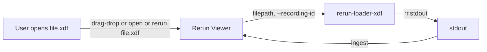

# Rerun XDF data loader plugin

## Context

- **Rerun external data loaders** ([docs](https://rerun.io/docs/reference/data-loaders/overview)): Any executable on `$PATH` whose name starts with `rerun-loader-` is invoked by the Rerun Viewer when the user opens a file. It receives the file path (positional) and optional `--recording-id`, `--application-id`, etc. If the loader does not support the file, it must exit with `rr.EXTERNAL_DATA_LOADER_INCOMPATIBLE_EXIT_CODE`. Otherwise it calls `rr.init(..., recording_id=...)`, `rr.stdout()`, then logs data so the Viewer ingests it from stdout.
- **Existing XDF → Rerun flow**: [rerun/xdf_imu_style.py](c:\Users\pho\repos\EmotivEpoc\ACTIVE_DEV\PhoOfflineEEGAnalysis\rerun\xdf_imu_style.py) loads an XDF via `pyxdf.load_xdf` and calls `stream_xdf_to_rerun_imu_style` from `phoofflineeeganalysis.converters.xdf_to_rerun`. That converter is referenced in plans but **the `converters.xdf_to_rerun` module was not found** under `src/phoofflineeeganalysis/` (no `converters` package in the repo). So the loader plugin must either assume that converter will exist and call it in “stdout-only” mode, or implement self-contained XDF→Rerun logging in the plugin script.
- **Reference**: The [docx loader example](https://github.com/rerun-io/rerun-loader-python-example-docx) shows the pattern: argparse for `filepath` and `--recording-id`, check file type, exit incompatible, then `rr.init(..., recording_id=args.recording_id)`, `rr.stdout()`, and log content.

## Goal

One Python script that acts as a Rerun external data loader for **.xdf** files so users can open `.xdf` directly in the Rerun Viewer (open dialog, drag-and-drop, or `rerun file.xdf`). The script must follow the external-loader contract and output Rerun logs to stdout.

## Design

### 1. Plugin contract (required)

- **Executable name**: Must be invokable as something starting with `rerun-loader-` (e.g. `rerun-loader-xdf`). So the script can be named `rerun_loader_xdf.py` and installed/symlinked as `rerun-loader-xdf` on PATH.
- **CLI**: Accept one positional argument `filepath` and optional `--recording-id` (and optionally `--application-id`). Do not require other flags so the Viewer can call it with just the path and recording-id.
- **Incompatible**: If the path is not a file or the extension is not `.xdf` (case-insensitive), exit with `rr.EXTERNAL_DATA_LOADER_INCOMPATIBLE_EXIT_CODE`.
- **Compatible**: Call `rr.init("rerun_loader_xdf", recording_id=args.recording_id)` (and application_id if provided), then `rr.stdout()`, then load the XDF and log to Rerun. Do **not** spawn the viewer or save to an .rrd file when used as a plugin (the Viewer is already open and reads from stdout).

### 2. XDF → Rerun logging

Two approaches:

- **Option A – Reuse converter (if/when it exists)**  
If `phoofflineeeganalysis.converters.xdf_to_rerun.stream_xdf_to_rerun_imu_style` is available, the loader can load XDF with `pyxdf.load_xdf`, then call the converter with `save_path=None`, `spawn=False`, and **without** calling `rr.init`/`rr.save`/`rr.spawn` inside the converter for this code path. That implies the converter must support a “log only” mode: caller sets up `rr.init` + `rr.stdout()` before calling, and the converter only logs (no save/spawn). The loader would then: `rr.init` + `rr.stdout()` → load XDF → call `stream_xdf_to_rerun_imu_style(streams, header, save_path=None, spawn=False)`.
- **Option B – Self-contained loader**  
The loader script depends only on `rerun-sdk` and `pyxdf`. It implements the same IMU-style logging as the (planned) converter: for each numeric stream, build time and channel columns and use `rr.send_columns` / `rr.Scalars.columns` (or the current Rerun API). No dependency on PhoOfflineEEGAnalysis. Best for a pipx-installable plugin; logic may be duplicated with the converter later.

**Recommendation**: Implement **Option B** in the plugin script so it works regardless of the converter’s existence, and keep the script in `rerun/` with minimal deps (`pyxdf`, `rerun-sdk`). If the converter is added later, the loader can be refactored to call it in log-only mode to avoid duplication.

### 3. File location and entrypoint

- **Script**: Add [rerun/rerun_loader_xdf.py](c:\Users\pho\repos\EmotivEpoc\ACTIVE_DEV\PhoOfflineEEGAnalysis\rerun\rerun_loader_xdf.py) (or `rerun_loader_xdf.py` under `rerun/`).
- **Shebang**: `#!/usr/bin/env python3` and executable bit so it can be symlinked or run as-is.
- **Installation for Rerun**: User must have the script on PATH as a name starting with `rerun-loader-`, e.g.:
  - Symlink: `rerun-loader-xdf` → `path/to/repo/rerun/rerun_loader_xdf.py`
  - Or a small `pyproject.toml` / `setup.py` in a `rerun/` subproject that defines a `console_scripts` entry `rerun-loader-xdf = rerun_loader_xdf:main`, then `pip install -e .` or `pipx install` from `rerun/` so `rerun-loader-xdf` is on PATH.

### 4. Dependencies and environment

- The existing [rerun/view_spectrograms_rerun.py](c:\Users\pho\repos\EmotivEpoc\ACTIVE_DEV\PhoOfflineEEGAnalysis\rerun\view_spectrograms_rerun.py) is run with `uv run --project rerun` (a separate rerun subproject). If `rerun/` has its own `pyproject.toml`, add `pyxdf` (and any other needed deps) there so `uv run --project rerun -- python rerun/rerun_loader_xdf.py ...` works. For the plugin to be invoked by the **Rerun Viewer**, the Viewer will use whatever Python/env is on PATH for `rerun-loader-xdf`; so for development, symlinking or installing the script so `rerun-loader-xdf` is on PATH is required.
- Minimal deps for the loader script: `rerun-sdk`, `pyxdf`. Optionally `pandas`/`numpy` if the IMU-style logging uses them (they are likely already pulled in by rerun-sdk/pyxdf).

### 5. Error handling

- If the file is not .xdf or not a file: exit with `rr.EXTERNAL_DATA_LOADER_INCOMPATIBLE_EXIT_CODE` (no stderr message required for “incompatible”).
- If the file is .xdf but loading or parsing fails: log a clear error to stderr and exit with a non-zero code (e.g. 1); do not use the incompatible code so the Viewer doesn’t treat it as “unsupported format”.

### 6. Optional: Recording ID and entity path prefix

- Use the Viewer-passed `--recording-id` (and `--application-id` if present) in `rr.init` so the loaded data appears in the same recording as other loaders for that open action.
- If the Viewer passes `--entity-path-prefix`, prepend it to all entity paths when logging (per [data-loaders overview](https://rerun.io/docs/reference/data-loaders/overview)).

## Implementation summary

| Step | Action                                                                                                                                                                                                                                                                                                                                                       |
| ---- | ------------------------------------------------------------------------------------------------------------------------------------------------------------------------------------------------------------------------------------------------------------------------------------------------------------------------------------------------------------ |
| 1    | Add `rerun/rerun_loader_xdf.py`: argparse for `filepath`, `--recording-id` (and optional `--application-id`, `--entity-path-prefix`). If not a file or not `.xdf`, exit with `rr.EXTERNAL_DATA_LOADER_INCOMPATIBLE_EXIT_CODE`.                                                                                                                               |
| 2    | After `rr.init(..., recording_id=args.recording_id)` and `rr.stdout()`, load XDF with `pyxdf.load_xdf(path, ...)` (same options as in xdf_imu_style: synchronize_clocks=True, handle_clock_resets=True, dejitter_timestamps=False).                                                                                                                          |
| 3    | Implement IMU-style logging in the script: for each numeric stream, build time column and per-channel columns, then log via `rr.send_columns` / `rr.Scalars.columns` (or equivalent) under an entity path like `xdf/{stream_name}`. Sanitize stream names for entity paths. Skip non-numeric streams or log them in a simple way (e.g. text log) if desired. |
| 4    | Ensure no `rr.save()` or `rr.spawn()` is called when used as a loader (Viewer reads from stdout).                                                                                                                                                                                                                                                            |
| 5    | Add `pyxdf` to the rerun subproject’s dependencies if `rerun/` has a `pyproject.toml`, so the script is runnable with `uv run --project rerun`.                                                                                                                                                                                                              |
| 6    | Document in the script docstring or a short README how to install the plugin on PATH as `rerun-loader-xdf` (symlink or console_scripts entry) so opening .xdf in the Rerun Viewer works.                                                                                                                                                                     |

## Data flow (high level)

## Files to add or touch

- **New**: [rerun/rerun_loader_xdf.py](c:\Users\pho\repos\EmotivEpoc\ACTIVE_DEV\PhoOfflineEEGAnalysis\rerun\rerun_loader_xdf.py) – main loader script (plugin entrypoint, CLI, XDF load, IMU-style Rerun logging).
- **Optional**: `rerun/pyproject.toml` (or existing one) – add `pyxdf` so `uv run --project rerun` can run the loader.
- **Optional**: Short note in `rerun/README.md` or in script docstring on installing as `rerun-loader-xdf` on PATH.

No changes to the existing [rerun/xdf_imu_style.py](c:\Users\pho\repos\EmotivEpoc\ACTIVE_DEV\PhoOfflineEEGAnalysis\rerun\xdf_imu_style.py) are required for the plugin to work; the plugin is a separate entrypoint for “open in Rerun Viewer” integration. Later, if `stream_xdf_to_rerun_imu_style` exists and supports log-only mode, the loader can be refactored to call it to avoid duplicating logging logic.