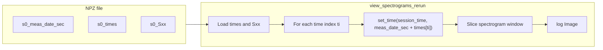

# Spectrogram timeline scrubbing in Rerun viewer

## Current state

- [export_spectrograms_for_rerun](PhoOfflineEEGAnalysis/main_analyze_run.py) writes **one .npz per session** with keys (for that single session, index 0): `session_indices`, `s0_meas_date_sec`, `s0_channel_names`, `s0_freqs`, `s0_times`, `s0_Sxx`. So the **single-session-XDF case** is one file with `session_indices = [0]` and all `s0_*` arrays.
- [view_spectrograms_rerun.py](PhoOfflineEEGAnalysis/rerun/view_spectrograms_rerun.py) currently loads only `s0_meas_date_sec`, `s0_channel_names`, `s0_Sxx`; it **does not load `s0_times`**. It logs **one** image per channel at a single timestamp (`meas_date_sec`), so the timeline has no per-time events and scrubbing does nothing.

## Data flow (after change)

## Implementation (viewer only)

All changes are in [rerun/view_spectrograms_rerun.py](PhoOfflineEEGAnalysis/rerun/view_spectrograms_rerun.py). No changes to `main_analyze_run.py` or export keys.

### 1. Load time axis

- After loading `Sxx` and deriving `n_ch, n_freq, n_time`, load the time axis: `times = np.asarray(data[f"s{idx}_times"]]).flatten()`.
- Assert or ensure `times.shape[0] == n_time` (export guarantees this). If missing (should not happen per your “not worrying about old export” constraint), fail fast with a clear error.

### 2. Time index stepping (downsampling)

- To keep .rrd size and playback manageable, limit the number of frames per channel (e.g. `max_frames = 500` or `1000`).
- Compute `step = max(1, n_time // max_frames)`. Use time indices `ti in range(0, n_time, step)` so the last frame may be slightly before end; optionally append `n_time - 1` so the last frame is the end of the recording (helps single-session short recordings).

### 3. Per-frame timestamp

- For each `ti`, set Rerun time to **recording time**: `rr.set_time("session_time", timestamp=meas_date_sec + times[ti])`.
- If `meas_date_sec` is NaN (export can write that when `meas_date` is missing), use a fallback: e.g. `rr.set_time_sequence("session_time", ti)` or `rr.set_time("session_time", duration=float(times[ti]))` so the timeline still has multiple events and remains scrollable. Prefer one code path that works for both (e.g. if nan use duration, else timestamp).

### 4. Sliding-window image per frame

- For each `ti`, define a window in **time indices** (columns of the spectrogram): e.g. `half_win = min(250, n_time // 4)`, `j_lo = max(0, ti - half_win)`, `j_hi = min(n_time, ti + half_win + 1)`.
- Slice that channel’s spectrogram: `Sxx_ch_window = Sxx_ch[:, j_lo:j_hi]` (shape `(n_freq, n_cols)`).
- Reuse **global** normalization for that channel (same `vmin`/`vmax` as today, computed once from full `Sxx_ch` before the loop) so the color scale is stable across frames.
- Convert to 0–1 image and log: `rr.log(entity_path, rr.Image(img_window))`.

### 5. Edge cases (single-session focus)

- **Very short recordings** (`n_time` small): if `n_time <= 1`, log a single frame (full spectrogram or the one column) at one time; no need for a window.
- **Single session**: the existing loop over `session_indices` (e.g. `[0]`) and keys `s0`_* already handles the one-session .npz; no structural change.
- **Channel count**: unchanged; still one entity path per channel, now with many logged images over time.

### 6. Optional CLI

- Optional `--max-frames` (default 500 or 1000) to cap frames per channel without changing code.

## Files to touch

- [rerun/view_spectrograms_rerun.py](PhoOfflineEEGAnalysis/rerun/view_spectrograms_rerun.py) only.

## Result

- Timeline has one event per (downsampled) time step per channel; scrubbing moves the playhead and updates the spectrogram to the window at that time.
- Single-session .npz (one XDF): one session with `idx=0`, `s0_times` and `s0_Sxx` drive multi-frame logging; scrubbing works for that session’s channels.

