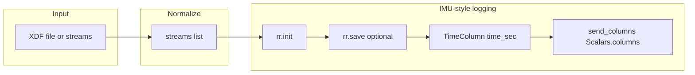

# XDF to Rerun IMU-style display

## Goal

Mirror the [Rerun IMU signals example](https://rerun.io/examples/feature-showcase/imu_signals): log multi-dimensional signals with `rr.send_columns()` and `rr.Scalars.columns()` so the viewer shows one time-series panel per stream with multiple lines (channels), instead of one entity per channel.

## IMU example pattern (reference)

- One entity per "sensor group" (e.g. `/gyroscope`, `/accelerometer`).
- Time index: `rr.TimeColumn("timestamp", timestamp=imu_data["timestamp"])`.
- Columns: `rr.Scalars.columns(scalars=gyro)` where `gyro` is a DataFrame with one column per axis (e.g. `gyro.x`, `gyro.y`, `gyro.z`).
- Result: one plot per entity with multiple series over time.

## Current xdf_to_rerun behavior

- [xdf_to_rerun.py](c:\Users\pho\repos\EmotivEpoc\ACTIVE_DEV\PhoOfflineEEGAnalysis\src\phoofflineeeganalysis\converters\xdf_to_rerun.py) logs **one entity per channel** (`xdf/{stream_name}/{ch_0}`, `.../ch_1`, ...) via sample-by-sample `rr.set_time` + `rr.log(..., rr.Scalars(value))`.
- That yields many separate scalar entities; the IMU example instead uses one entity per stream with multiple scalar columns.

## Approach

1. **Create a `rerun` directory** in the repo (no existing one). Use `**rerun/**` at the project root (next to `src/`, `examples_jupyter/`) so "the @rerun directory" is a clear, dedicated place for Rerun examples.
2. **Implement an IMU-style converter** that:
  - Accepts the same inputs as `stream_xdf_to_rerun` (XDF file path, or `(streams, header)`, or object with `.xdf_streams`).
  - For each **numeric** stream: build a time column (e.g. `time_sec` = `time_stamps - t0`) and a DataFrame with one column per channel (using the same channel labels as [xdf_to_rerun](c:\Users\pho\repos\EmotivEpoc\ACTIVE_DEV\PhoOfflineEEGAnalysis\src\phoofflineeeganalysis\converters\xdf_to_rerun.py): from stream `info.desc` or `ch_0`, `ch_1`, ...).
  - Call `rr.init(...)`, optional `rr.save(save_path)`, then per stream:
    - `times = rr.TimeColumn("time_sec", duration=time_sec_array)` (or equivalent in 0.6: `timestamp=` / `duration=` as the API exposes).
    - `rr.send_columns(f"xdf/{safe_stream_name}", indexes=[times], columns=rr.Scalars.columns(scalars=channel_df))`.
  - Skip or keep existing marker handling (TextLog) as in xdf_to_rerun; optional for minimal first version.
3. **Reuse logic from xdf_to_rerun** to avoid duplication: import and use `_sanitize_entity_name` and `_channel_labels_from_stream` from [xdf_to_rerun.py](c:\Users\pho\repos\EmotivEpoc\ACTIVE_DEV\PhoOfflineEEGAnalysis\src\phoofflineeeganalysis\converters\xdf_to_rerun.py); keep stream iteration and input normalization in the new script or in the converter (see below).
4. **Where to put the IMU-style logging**:
  - **Option A**: New function in [xdf_to_rerun.py](c:\Users\pho\repos\EmotivEpoc\ACTIVE_DEV\PhoOfflineEEGAnalysis\src\phoofflineeeganalysis\converters\xdf_to_rerun.py), e.g. `stream_xdf_to_rerun_imu_style(...)`, and the `rerun/` script only loads XDF and calls it (thin runner).
  - **Option B**: All IMU-style logic in a single script under `rerun/` that imports helpers from xdf_to_rerun and implements send_columns locally.
  - **Recommendation**: **Option A** — add `stream_xdf_to_rerun_imu_style()` in the converter module so the recording logic stays in one place and can be called from both CLI and the rerun example; the `rerun/` directory then contains a small runnable example (and optionally a README) that loads an XDF and calls `stream_xdf_to_rerun_imu_style(...)`.

## Implementation plan

### 1. Rerun directory and example script

- Create `**rerun/**` at project root.
- Add `**rerun/xdf_imu_style.py**` (or `rerun/stream_xdf_imu_style.py`) that:
  - Parses CLI: XDF path, optional `--save`, `--no-spawn`, `--step` (for optional downsampling before send_columns).
  - Loads XDF via `pyxdf.load_xdf(...)` (or uses LabRecorderXDF if preferred for consistency).
  - Calls `stream_xdf_to_rerun_imu_style(streams, header_or_none, save_path=..., spawn=...)`.
  - Runnable as `uv run python rerun/xdf_imu_style.py path/to/file.xdf` (or `python -m` if we add `rerun` as a package; keeping it as a script under `rerun/` is simpler).
- Optionally add `**rerun/README.md**` briefly describing the IMU-style example and how it relates to the [Rerun IMU example](https://rerun.io/examples/feature-showcase/imu_signals).

### 2. New function in xdf_to_rerun.py: `stream_xdf_to_rerun_imu_style`

- **Signature**: Same input pattern as `stream_xdf_to_rerun`: `data` (tuple or object with `.xdf_streams`), `save_path=None`, `spawn=True`, `stream_names=None`. Optionally `step=1` to downsample before sending (to reduce partition size).
- **Normalization**: Reuse the same logic as `stream_xdf_to_rerun` to get `streams` from `data`.
- **Per numeric stream**:
  - Get `time_stamps`, `time_series`, `t0`, `safe_name`, channel labels (reuse `_channel_labels_from_stream`, `_sanitize_entity_name`).
  - Build `time_sec = (time_stamps - t0)`; optionally apply `step` (e.g. `time_sec = time_sec[::step]`, `time_series = time_series[::step]`).
  - Build a pandas DataFrame with columns = channel labels and rows = samples (each column is one channel’s time series).
  - Call `rr.TimeColumn("time_sec", duration=time_sec)` (or the correct 0.6 API name: e.g. `duration=` for relative seconds).
  - Call `rr.send_columns(f"xdf/{safe_name}", indexes=[times], columns=rr.Scalars.columns(scalars=channel_df))`.
- **Rerun lifecycle**: `rr.init("xdf_imu_style", spawn=spawn)`; if `save_path`: `rr.save(save_path)`; then loop streams and send_columns.
- **Markers (fs==0)**: Either skip in IMU-style or keep current TextLog loop; plan suggests keeping minimal marker support (same as current) for consistency.
- **API check**: In rerun-sdk 0.6, confirm the exact names: `TimeColumn(..., duration=array)` vs `timestamp=`. Docs suggest `duration=` for relative seconds; if only `sequence`/`timestamp` exist, use `timestamp=t0 + time_sec` or convert to a format the API accepts.

### 3. Optional blueprint (later)

- The IMU example may use a blueprint to arrange time-series views. If the default Rerun view already shows one time-series panel per entity with multiple series, no blueprint is strictly necessary. If we want to mirror the example layout (e.g. one row per stream), we can add a small blueprint in a follow-up; leave out of initial scope if the default view is acceptable.

### 4. Dependencies and style

- No new dependencies; use existing `rerun-sdk`, `pandas`, `numpy`, `pyxdf`.
- Follow project rules: single-line function signatures where possible, two blank lines between methods, minimal edits.

## Data flow

## Files to add or change

| Path                                                                                                                                                                        | Action                                                          |
| --------------------------------------------------------------------------------------------------------------------------------------------------------------------------- | --------------------------------------------------------------- |
| `rerun/`                                                                                                                                                                    | Create directory                                                |
| `rerun/xdf_imu_style.py`                                                                                                                                                    | New script: CLI, load XDF, call `stream_xdf_to_rerun_imu_style` |
| `rerun/README.md`                                                                                                                                                           | Optional: short description and link to Rerun IMU example       |
| [src/phoofflineeeganalysis/converters/xdf_to_rerun.py](c:\Users\pho\repos\EmotivEpoc\ACTIVE_DEV\PhoOfflineEEGAnalysis\src\phoofflineeeganalysis\converters\xdf_to_rerun.py) | Add `stream_xdf_to_rerun_imu_style()`, reuse existing helpers   |

## Out of scope

- Changing the existing sample-by-sample `stream_xdf_to_rerun()` behavior (keep both APIs).
- Adding a blueprint in the first iteration unless required for parity with the IMU example screenshot.

