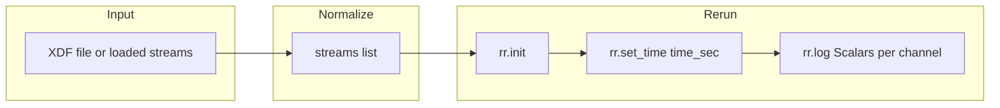

# XDF to Rerun streaming converter

## Scope

- **Single new file**: [src/phoofflineeeganalysis/converters/xdf_to_rerun.py](c:\Users\pho\repos\EmotivEpoc\ACTIVE_DEV\PhoOfflineEEGAnalysis\src\phoofflineeeganalysis\converters\xdf_to_rerun.py) (create the `converters` package and this module only).
- **Input**: Data already loaded from an XDF file — either:
  - `(streams, header)` from `pyxdf.load_xdf(path)`, or
  - A [LabRecorderXDF](c:\Users\pho\repos\EmotivEpoc\ACTIVE_DEV\PhoOfflineEEGAnalysis\src\phoofflineeeganalysis\analysis\xdf_files.py) instance (use `.xdf_streams` and optionally `.xdf_header`).
- **Output**: Rerun recording — either spawn viewer, save to `.rrd`, or both (per [Rerun docs](https://rerun.io/docs/concepts/how-does-rerun-work): `rr.init()`, `rr.save()` / `rr.connect()`).
- **Dependency**: `rerun-sdk>=0.6.0` is already in [pyproject.toml](c:\Users\pho\repos\EmotivEpoc\ACTIVE_DEV\PhoOfflineEEGAnalysis\pyproject.toml) (optional); no change needed.

## XDF stream shape (from existing code)

From [xdf_files.py](c:\Users\pho\repos\EmotivEpoc\ACTIVE_DEV\PhoOfflineEEGAnalysis\src\phoofflineeeganalysis\analysis\xdf_files.py):

- Each **stream** is a dict: `stream['info']['name'][0]`, `stream['time_stamps']` (1D array), `stream['time_series']` (shape `n_samples × n_channels`), `stream['clock_times']`, `stream['info']['nominal_srate'][0]`, `stream['info'].get('desc', [{}])[0]` for metadata/channel info.
- **Regular streams** (e.g. EEG): numeric `time_series`, `fs > 0`. **Irregular streams** (e.g. markers): `fs == 0`, `time_series` can be strings.

## Rerun usage (0.6.x)

- `rr.init(app_id, spawn=True)` to open viewer; `rr.save("path.rrd")` to record to file.
- One timeline for time: `rr.set_time("time_sec", duration=seconds)` (relative seconds from stream start).
- Per time step: `rr.log("entity/path", rr.Scalars(value))` — one scalar value per log call for correct time-series; multiple entity paths (one per channel) at the same time step.
- Entity paths: alphanumeric/safe; e.g. `xdf/StreamName/ch_0` with stream name sanitized (replace spaces/special chars with `_`).

## Implementation plan

### 1. Create package and module

- Add directory `src/phoofflineeeganalysis/converters/`.
- Add `src/phoofflineeeganalysis/converters/__init__.py` (re-export the public function only, or empty if you prefer a single standalone script that can be run without package import).
- Add single module `src/phoofflineeeganalysis/converters/xdf_to_rerun.py`.

### 2. Input normalization

- `**stream_xdf_to_rerun(data, *, save_path=None, spawn=True, step=1, stream_names=None)**`
- `**data**` may be:
  - A **tuple** `(streams, header)` (list of stream dicts + header from pyxdf).
  - A **LabRecorderXDF** instance: use `data.xdf_streams` and optionally `data.xdf_header`; no need to call `perform_load_xdf_streams` (we only need raw streams).
- Normalize to a list of stream dicts and optional header at the start of the function.

### 3. Per-stream logic

- **Skip**: Empty `time_series` or streams not in `stream_names` (if provided).
- **Entity path base**: Sanitize `stream['info']['name'][0]` for use in paths (e.g. `re.sub(r"[^a-zA-Z0-9_]", "_", name)`), then base path like `xdf/{safe_name}`.
- **Channel labels**: Try `stream['info'].get('desc', [{}])[0]` for channel list (XDF/LSL often has `channels` or `channel` in desc); else use `ch_0`, `ch_1`, ... up to `n_channels`.
- **Time base**: Use `time_stamps = np.asarray(stream['time_stamps'])`; `t0 = time_stamps[0]` (or min) so duration is `time_stamps[i] - t0` in seconds.

### 4. Regular (numeric) streams — stream into Rerun

- `time_series`: shape `(n_samples, n_channels)`; ensure numeric (e.g. `np.asarray(..., dtype=float)`; skip stream if not numeric).
- Loop over sample index `i` with **step** (e.g. `range(0, n_samples, step)`):
  - `rr.set_time("time_sec", duration=float(time_stamps[i] - t0))`
  - For each channel `c`: `rr.log(f"xdf/{safe_name}/{ch_label}", rr.Scalars(time_series[i, c]))`
- This gives one Rerun “frame” per (stepped) sample with all channels logged at that time; step reduces load for long recordings.

### 5. Irregular (marker/event) streams — optional

- If `fs == 0` and `time_series` is string-like (or 1D): at each timestamp log a **TextLog** (e.g. `rr.log("xdf/Markers", rr.TextLog(text)`, with `rr.set_time("time_sec", duration=...)`). Keep implementation minimal (e.g. one entity `xdf/{safe_name}/markers` and log each event).

### 6. Rerun lifecycle

- At start: `rr.init("xdf_to_rerun", spawn=spawn)`; if `save_path`: `rr.save(save_path)`.
- Run all streams in sequence (so one continuous recording with multiple entity trees).
- No need to call `rr.connect()` when using `rr.save()`; spawn opens the viewer that can open the saved file or receive live data depending on Rerun 0.6 behavior (spawn typically implies connection for live view).

### 7. CLI / `if __name__ == "__main__"`

- Parse one positional arg: path to an XDF file.
- Load with `pyxdf.load_xdf(path)` (or optionally `LabRecorderXDF.init_basic_from_lab_recorder_xdf_file(path)` and pass `.xdf_streams`).
- Call `stream_xdf_to_rerun(streams, save_path=Path(path).with_suffix(".rrd"), spawn=True, step=1)` (step configurable via argparse if desired).
- Keeps the tool runnable as `python -m phoofflineeeganalysis.converters.xdf_to_rerun file.xdf`.

### 8. Code style (project rules)

- Function signatures on one line where possible; minimal edits; two blank lines between methods; use `uv` for deps (already present).

## Data flow (high level)

## Files to add

| Path                                                   | Action                                                                         |
| ------------------------------------------------------ | ------------------------------------------------------------------------------ |
| `src/phoofflineeeganalysis/converters/`                | Create directory                                                               |
| `src/phoofflineeeganalysis/converters/__init__.py`     | Add (optional: export `stream_xdf_to_rerun`)                                   |
| `src/phoofflineeeganalysis/converters/xdf_to_rerun.py` | Single module: input normalization, per-stream loop, Rerun logging, `__main__` |

## Out of scope (basic tool)

- No dependency on full `LabRecorderXDF` processing (MNE Raw, etc.); only raw stream dicts.
- No optional blueprint/SeriesLines styling in this first version (can be added later).
- No downsampling beyond the `step` parameter.

